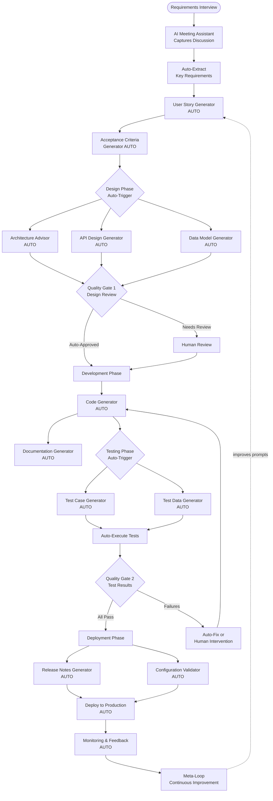
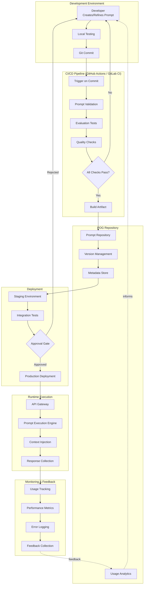
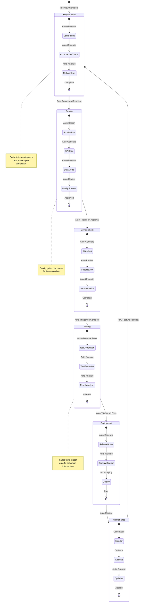
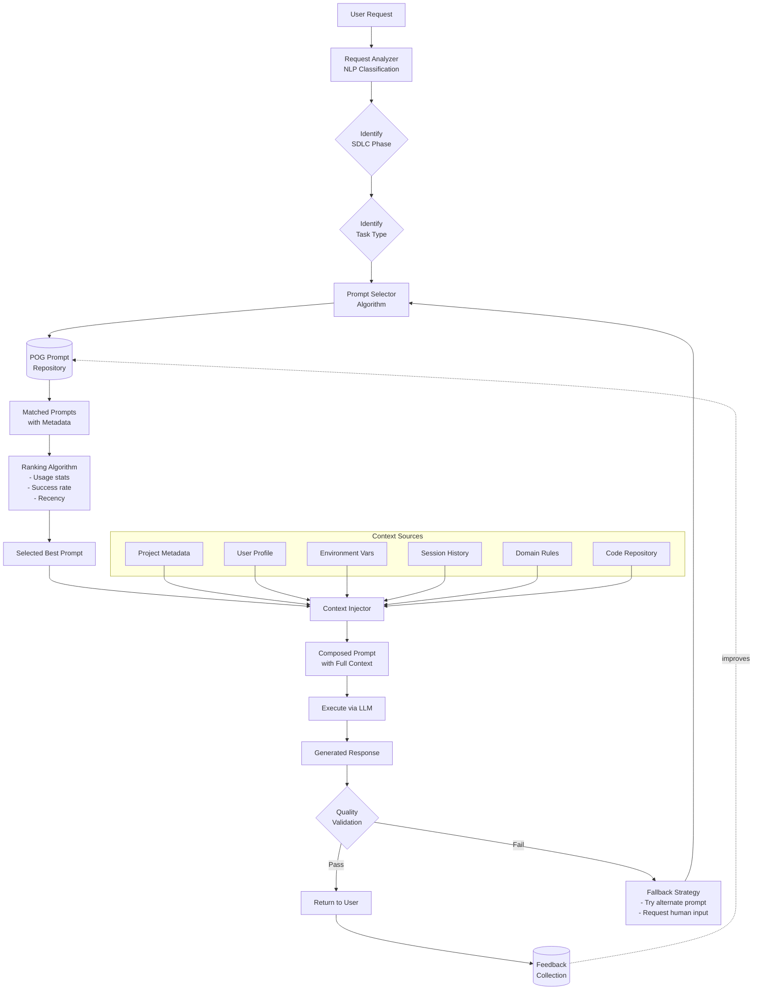
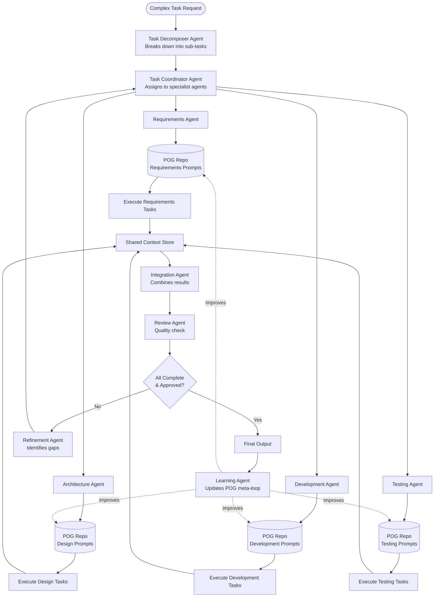

# POG Automation Diagrams

This page contains diagrams illustrating automation workflows and end-to-end automation architecture for the Prompt Orchestration Governance framework.

---

## Diagram 7: End-to-End Automation Pipeline

This diagram shows the complete automation flow from requirements interview to deployment, demonstrating how POG enables fully automated feature development.

**Description**: This end-to-end automation pipeline shows how POG can orchestrate an entire feature development from requirements interview to production deployment. Key automation points include:
- Automatic extraction and structuring of requirements
- Auto-triggered SDLC phase transitions
- Automated code generation, testing, and deployment
- Quality gates for human oversight when needed
- Continuous feedback loop for improvement

---

## Diagram 8: CI/CD Integration Architecture

This diagram illustrates how POG integrates with CI/CD pipelines for automated prompt deployment and execution.

**Description**: This architecture shows POG's integration with modern CI/CD pipelines:
- **Development**: Developers create and test prompts locally
- **CI Pipeline**: Automated validation, testing, and quality checks
- **POG Repository**: Centralized storage with versioning and metadata
- **Deployment**: Staged rollout with approval gates
- **Runtime**: Production execution with context injection
- **Monitoring**: Comprehensive feedback loop for continuous improvement

---

## Diagram 9: Automated SDLC Phase Transitions

This diagram shows how POG automatically triggers and orchestrates transitions between SDLC phases.

**Description**: This state machine illustrates POG's automated phase transitions:
- Each SDLC phase automatically triggers the next upon completion
- Sub-tasks within each phase execute automatically
- Quality gates provide human oversight opportunities
- Failures trigger appropriate intervention (auto-fix or human review)
- Continuous cycle from maintenance back to requirements

---

## Diagram 10: Intelligent Prompt Selection & Context Injection

This diagram shows how POG automatically selects appropriate prompts and injects context at runtime.

**Description**: This flow demonstrates POG's intelligent automation:
- **Request Analysis**: NLP classification identifies intent and context
- **Smart Selection**: Algorithm matches request to optimal prompt
- **Context Injection**: Automatically gathers and injects relevant context from multiple sources
- **Quality Validation**: Ensures response meets quality standards
- **Fallback Handling**: Automatic recovery strategies for failures
- **Continuous Learning**: Feedback improves future selections

---

## Diagram 11: Multi-Agent Collaboration Workflow

This diagram illustrates how multiple AI agents collaborate within POG framework to complete complex tasks.

**Description**: Multi-agent collaboration pattern in POG:
- **Task Decomposition**: Complex requests broken into manageable sub-tasks
- **Specialist Agents**: Each agent focuses on specific SDLC phase
- **POG Integration**: All agents leverage phase-appropriate prompts from repository
- **Shared Context**: Agents collaborate via shared context store
- **Quality Assurance**: Review agent ensures coherence and quality
- **Continuous Learning**: Learning agent feeds insights back to POG

---

## Automation Best Practices

### 1. Human-in-the-Loop Points

While POG enables extensive automation, strategic human oversight is crucial:

- **Quality Gates**: Design review, critical security decisions
- **Compliance Checks**: Regulatory requirements, legal reviews
- **Creative Decisions**: UX design choices, brand alignment
- **Risk Assessment**: High-impact changes, production deployments

### 2. Fallback Strategies

Automation should include robust fallback mechanisms:

- **Confidence Thresholds**: Route low-confidence outputs to human review
- **Alternate Prompts**: Try different prompts if first attempt fails
- **Escalation Paths**: Clear escalation when automation cannot proceed
- **Manual Override**: Always allow human intervention

### 3. Monitoring & Alerting

Comprehensive monitoring ensures automation health:

- **Success Rates**: Track automation success vs. fallback rates
- **Performance Metrics**: Monitor latency, cost, quality
- **Anomaly Detection**: Alert on unusual patterns or errors
- **Feedback Loops**: Continuous improvement based on outcomes

---

## Implementation Considerations

### Gradual Automation Adoption

1. **Phase 1: Manual with POG**: Use POG prompts manually
2. **Phase 2**: Automate simple, low-risk tasks
3. **Phase 3**: Add CI/CD integration
4. **Phase 4**: Implement phase auto-transitions
5. **Phase 5**: Full end-to-end automation with oversight

### Technology Requirements

- **Orchestration Platform**: Airflow, Temporal, or custom
- **CI/CD System**: GitHub Actions, GitLab CI, Jenkins
- **API Gateway**: For runtime prompt execution
- **Monitoring Stack**: Prometheus, Grafana, ELK
- **Storage**: Git + database for prompt repository

### Security & Compliance

- **Access Control**: Role-based access to automation triggers
- **Audit Trails**: Complete logging of automated actions
- **Secrets Management**: Secure handling of credentials
- **Compliance**: Ensure automated processes meet regulatory requirements

---

*Back to [Main Documentation](index.md) | [Diagrams](diagrams.md)*
