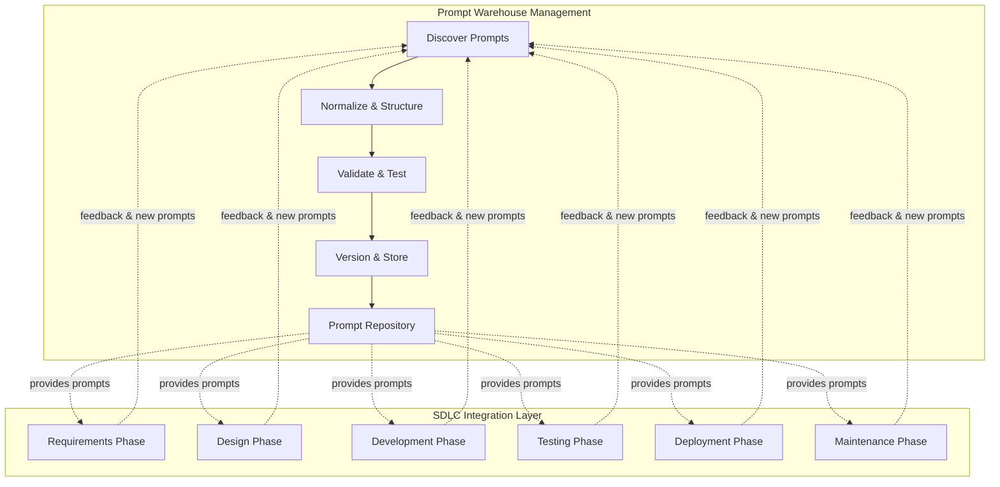
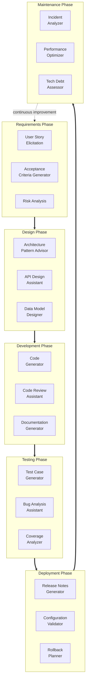
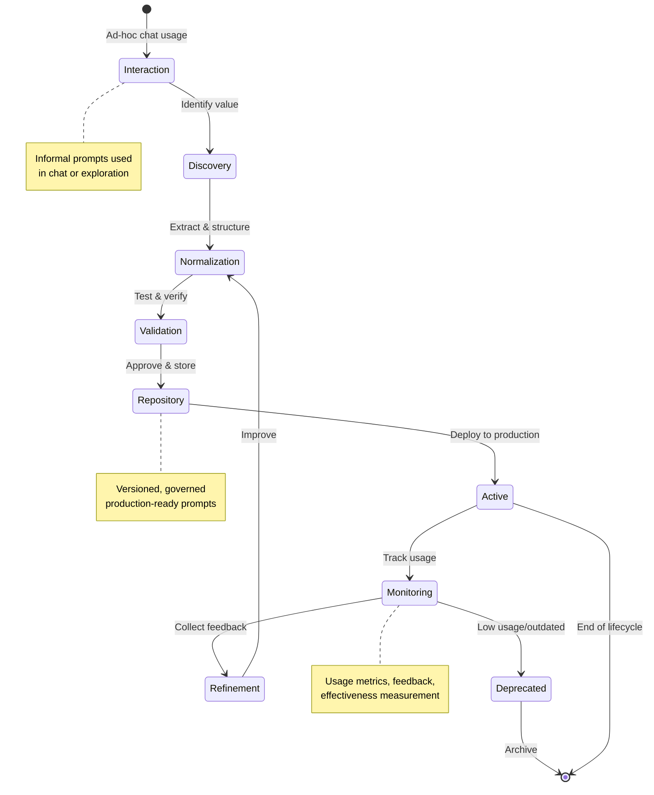
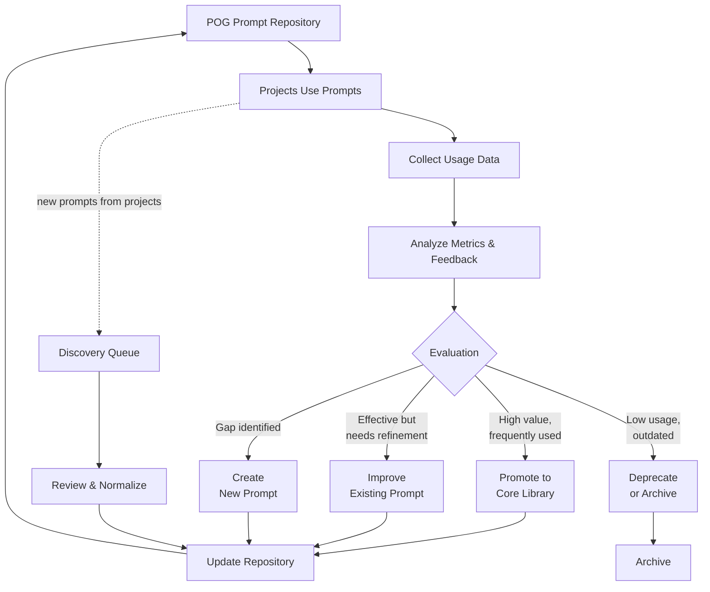
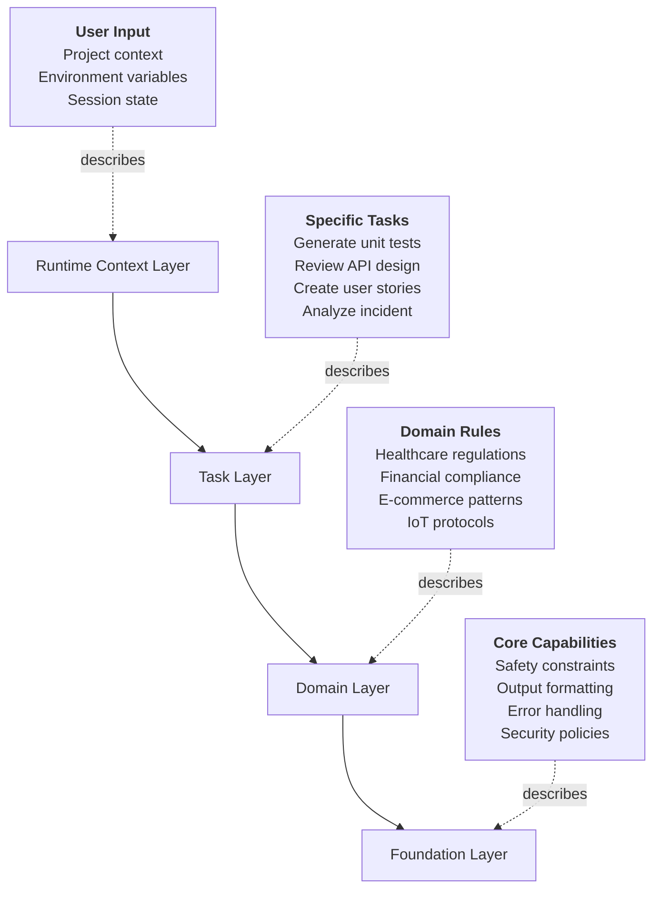
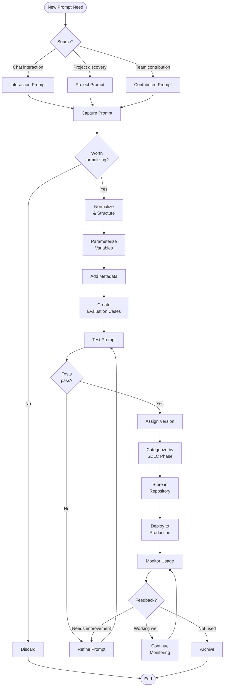

# POG Diagrams

This page contains all the visual diagrams for the Prompt Orchestration Governance framework.

---

## Diagram 1: POG Dual Architecture Overview

This diagram illustrates the two core functions of POG: Prompt Warehouse Management and SDLC Integration.

**Description**: The Prompt Warehouse Management function discovers, normalizes, validates, and stores prompts. The SDLC Integration Layer provides phase-specific prompts to each stage of software development. Feedback from SDLC usage continuously improves the prompt repository.

---

## Diagram 2: SDLC Phase Prompt Flow

This diagram shows how different prompts are invoked at each SDLC phase with specific examples.

**Description**: Each SDLC phase has dedicated prompt categories that address specific needs. The cycle is continuous, with maintenance phase insights feeding back into requirements for the next iteration.

---

## Diagram 3: Prompt Lifecycle State Machine

This diagram illustrates how prompts evolve from ad-hoc interactions to production-ready skill prompts.

**Description**: Prompts begin as informal interactions, progress through discovery and normalization, get validated, and become production-ready skill prompts. Continuous monitoring enables refinement, and prompts can be deprecated when no longer useful.

---

## Diagram 4: Meta-Loop - POG Self-Improvement

This diagram shows how POG continuously improves its own prompt library through feedback and usage analysis.

**Description**: POG implements a meta-loop where prompt usage is continuously monitored, analyzed, and fed back into the repository. High-value prompts are promoted, existing ones are refined, gaps trigger new prompt creation, and low-value prompts are deprecated. This ensures the prompt library evolves with organizational needs.

---

## Diagram 5: Orchestration Layers Hierarchy

This diagram shows the hierarchical layers that organize prompts by scope and context.

**Description**: Prompts are organized in hierarchical layers, from the foundational system capabilities up to runtime-specific context. Each layer builds upon the layers below it:

- **Foundation Layer**: Universal system policies and constraints
- **Domain Layer**: Business-specific rules and patterns
- **Task Layer**: Specific development tasks and intents
- **Runtime Context Layer**: Dynamic, session-specific information

This layering enables prompt composition and context management.

---

## Diagram 6: Prompt Lifecycle Flow (Detailed)

This diagram provides a detailed view of the prompt management lifecycle with decision points.

**Description**: This detailed flow shows the complete journey of a prompt from identification through deployment and monitoring, including quality gates and decision points that ensure only valuable, tested prompts reach production.

---

*For more information, see the [main whitepaper](index.md).*
