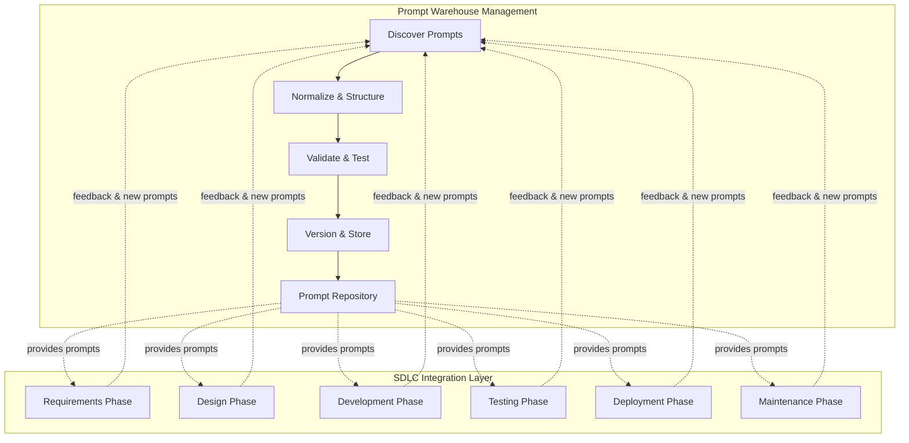
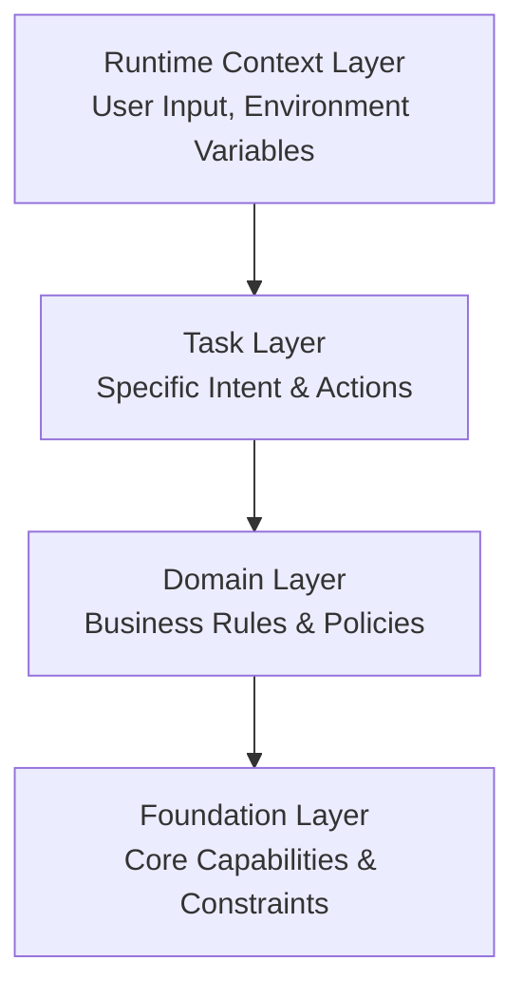
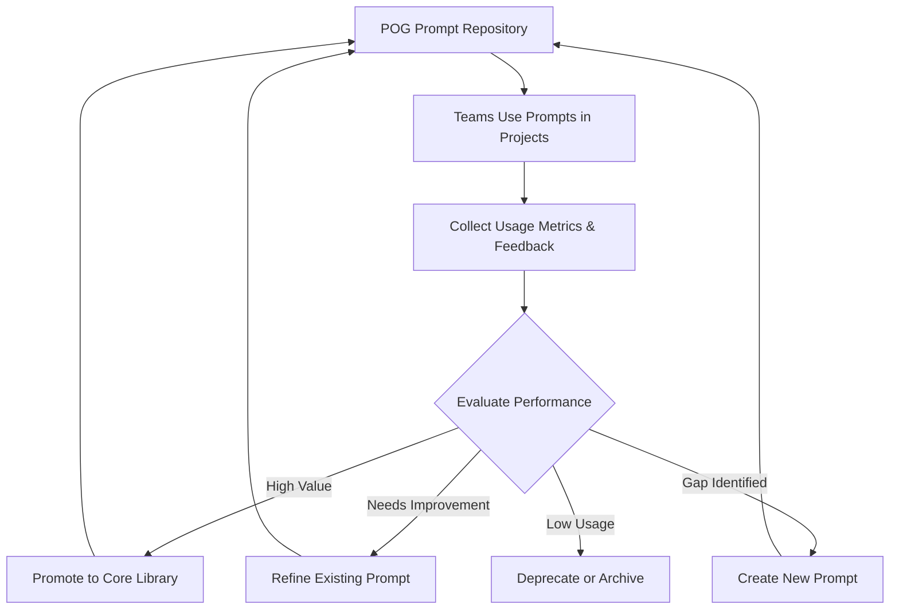

# Prompt Orchestration Governance (POG)

**A Framework for Managing Prompts as First-Class Software Assets Across the SDLC**

Version 1.0 | January 2026

**Tags:** `#POG` `#PromptOrchestrationGovernance` `#LLM` `#Governance` `#SDLC`

---

## Executive Summary

Large Language Models (LLMs) have transformed how software is developed, yet most organizations lack a structured approach to managing the prompts that drive AI-enabled systems. **Prompt Orchestration Governance (POG)** provides a practical framework for making the Software Development Life Cycle (SDLC) more efficient through structured prompt management and usage.

POG addresses two critical needs:

1. **Prompt Warehouse Management**: A systematic process to discover, normalize, validate, and version prompts as reusable assets
2. **SDLC Integration**: Phase-specific prompts that accelerate each stage of software development from requirements gathering to maintenance

Rather than treating prompts as ad-hoc inputs, POG positions them as **first-class software assets** that can be discovered, refined, governed, and strategically deployed across the entire software lifecycle.

---

## What is POG? – Precise Definition

### One-Sentence Definition (Definition Snippet)

**POG (Prompt Orchestration Governance)** is an engineering and governance methodology where **Prompts are treated as First-Class Specifications** in AI-driven systems, enabling systematic management of human intent, model behavior, and system outcomes for controllability and consistency.

### Extended Definition (Context for LLM Understanding)

In traditional software engineering, specifications typically define system behavior through documentation, code, or processes. In AI/LLM systems, **Prompts themselves have become the primary control layer that directly influences behavior**.

POG asserts that:

- Prompts are not merely input text, but **designable, auditable, versionable, and governable system components**
- As prompts scale from single-use to multi-team orchestration, they naturally evolve into structured artifacts—mirroring how teams manage code
- A shared vocabulary and lifecycle framework enables teams to recognize, refine, and operationalize prompt patterns across the organization

### POG vs Prompt Engineering vs Traditional Software Engineering

| Aspect | Prompt Engineering | POG | Traditional SDLC |
|--------|-------------------|-----|------------------|
| **Focus** | How to write effective prompts | How prompts fit into organizational systems and lifecycle | How software systems are built and maintained |
| **Scope** | Individual developer technique | Organizational governance, asset management, and operationalization | System-wide processes, tools, and standards |
| **Key Activity** | Crafting, testing, iterating prompts | Discovering, normalizing, versioning, deploying prompts as reusable assets | Requirements, design, code, deployment |
| **Outcome** | A working prompt | Prompt artifacts integrated into SDLC workflows | Functional software system |

**In short:**
- **Prompt Engineering** = Technical skill / "How do I write a better prompt?"
- **POG** = Governance framework / "How do we manage prompts systematically at scale?"
- **Traditional SDLC** = System lifecycle / "How do we build software?"

**Relationship:** POG does not replace traditional software engineering. Instead, it addresses gaps where traditional specifications and controls are insufficient to describe AI/LLM system behavior. Use traditional SDLC as your foundation, Prompt Engineering as your technical practice, and POG as your governance layer.

---

## Scope & Intent

This paper is **not** an attempt to standardize prompt practices, nor does it propose replacing existing engineering or governance models. Rather, it names a missing layer that becomes visible only when prompts are shared, reused, and operationalized at scale.

Many teams independently and without coordination converge on similar patterns for managing prompts. This paper offers a lens for reasoning about those patterns, not a mandate for how they must look. If your experience differs from what's described here, that mismatch itself is valuable signal for how the model needs to evolve.

---

## 1. Problem Statement

### 1.1 The Fragmentation Pattern in AI-Enabled Development

Modern software development increasingly relies on AI assistance through prompts. What we observe is not that organizations are "missing" something but rather that teams, working independently, have converged on remarkably similar challenges:

- **Scattered Prompts**: Effective prompts emerge from projects and conversations, but remain trapped in chat histories or local notebooks
- **Reimplementation Cycle**: Each team rediscovers similar patterns independently because there's no shared vocabulary to recognize and reuse them
- **Hidden Institutional Knowledge**: Valuable patterns exist but aren't surfaced or named systematically
- **Phase Misalignment**: Teams often find prompts are scattered across different contexts, making them hard to locate when a new phase begins

### 1.2 Why Fragmentation Costs Organizations

The cost does not arise from a fundamental mismatch in how teams approach prompts. Rather, the friction emerges because:

- **No Common Vocabulary**: Teams discover similar patterns but call them different things, so each team treats their solution as context-specific rather than reusable
- **Implicit vs. Explicit**: Patterns that work are often implicit embedded in conversations, experience, or individual practice and difficult to extract
- **Isolation**: Without a structured way to surface valuable prompts, learning from one project doesn't systematically transfer to the next
- **No Feedback Loop**: Prompts that work well in one context have no path to be refined, tested, and returned to other teams

**The challenge is not that teams are doing something wrong. The challenge is the absence of a shared language and mechanism to name and reuse what they're already doing well.**

---

## 2. Prompts as First-Class Software Assets

POG names a pattern we observe across mature teams: prompts, once valuable enough to be reused, naturally evolve to resemble first-class software artifacts structured, versioned, and auditable.

### 2.1 Observation

> **What We See in Practice**: When teams scale from single-project exploration to multi-team orchestration, prompts that were initially ephemeral gradually become structured. They acquire versions, metadata, and test cases. They move from chat contexts to repositories. This is not a mandate it's what naturally emerges when prompts begin to be shared and operationalized.

### 2.2 Patterns We Recognize

When prompts cross the threshold from single-use to shared, teams naturally organize them in ways that parallel how they manage code:

| What Teams Already Do | How We Name It |
|---------------------|-----|
| Craft reusable prompt text | Prompt Artifact |
| Collect working prompts in one place | Prompt Repository |
| Test prompts against known cases | Prompt Evaluation Case |
| Track changes to prompts over time | Prompt Versioning |
| Move prompts into production use | Prompt Activation |
| Simplify and generalize prompts | Prompt Normalization |

This mapping is not "how you should do it." It's "what we observe when teams do this at scale."

### 2.3 Prompt Evolution: The Natural Progression

We observe prompts follow a fairly consistent trajectory as they move from experimental to operational:

1. **Interaction Prompts**: Emerged in conversations or exploration; unsystematic
2. **Discovered Prompts**: Recognized as valuable; someone decides to preserve it
3. **Normalized Prompts**: Extracted, parameterized, made more general than its original context
4. **Validated Prompts**: Tested against known cases; refined based on results
5. **Skill Prompts**: Ready for production reuse; versioned, with clear metadata

Not all prompts should follow this path many are useful at stage 1. The stages describe what we see, not what every prompt must become.

## 3. POG Dual Architecture

POG operates through two interconnected functions:

---

## 4. Function 1: Prompt Warehouse Management

The Prompt Warehouse Management function ensures prompts are systematically captured, refined, and maintained.

### 4.1 Discovery Phase

**Goal**: Identify valuable prompts from various sources

**Activities**:
- Monitor chat interactions and exploration sessions
- Collect prompts from completed projects
- Gather community contributions
- Identify gaps in current prompt coverage

**Outputs**: Candidate prompts for normalization

### 4.2 Normalization Phase

**Goal**: Transform ad-hoc prompts into reusable, structured artifacts

**Activities**:
- Extract intent and core logic
- Parameterize variable elements
- Generalize for broader applicability
- Add metadata (purpose, phase, complexity)
- Structure using consistent formats

**Outputs**: Well-formed prompt templates

### 4.3 Validation Phase

**Goal**: Ensure prompt quality and effectiveness

**Activities**:
- Create evaluation test cases
- Test against known inputs/outputs
- Verify prompt behavior consistency
- Assess edge cases and failure modes
- Review for bias, safety, and compliance

**Outputs**: Validated, tested prompts

### 4.4 Versioning & Repository Management

**Goal**: Maintain prompt lifecycle and traceability

**Activities**:
- Assign version numbers
- Categorize by SDLC phase and domain
- Store in centralized repository
- Track usage metrics and feedback
- Deprecate outdated prompts

**Outputs**: Production-ready skill prompts in repository

---

*Note: This model describes a pattern we observe, not a prescription. Small teams, exploratory workflows, and less-structured contexts may not require all of these phases. The framework is descriptive, not normative.*

---

## 5. Function 2: SDLC-Aligned Prompt Library

POG provides phase-specific prompts that accelerate each stage of software development.

### 5.1 Requirements Phase Prompts

**Purpose**: Facilitate requirements gathering, analysis, and documentation

**Prompt Categories**:
- **User Story Elicitation**: Generate user stories from stakeholder interviews
- **Acceptance Criteria Generation**: Define testable acceptance criteria
- **Requirements Validation**: Check completeness and consistency
- **Risk Analysis**: Identify technical and business risks early

**Example Use Case**: When starting a new feature, developers invoke "User Story Generator" prompt to structure stakeholder input into well-formed user stories.

### 5.2 Design Phase Prompts

**Purpose**: Support architecture and detailed design activities

**Prompt Categories**:
- **Architecture Pattern Suggestion**: Recommend suitable architectural patterns
- **API Design**: Generate API specifications and endpoint definitions
- **Data Model Design**: Propose database schemas and relationships
- **Design Review**: Analyze designs for best practices

**Example Use Case**: Developers use "API Design Assistant" prompt to generate RESTful API specifications from functional requirements.

### 5.3 Development Phase Prompts

**Purpose**: Accelerate coding, refactoring, and documentation

**Prompt Categories**:
- **Code Generation**: Create boilerplate and implementation code
- **Code Review**: Analyze code for quality issues
- **Refactoring Suggestions**: Identify improvement opportunities
- **Documentation Generation**: Create inline and external documentation

**Example Use Case**: Developers use "Code Review Assistant" to get suggestions for improving code quality before submitting pull requests.

### 5.4 Testing Phase Prompts

**Purpose**: Enhance test coverage and quality assurance

**Prompt Categories**:
- **Test Case Generation**: Create unit, integration, and E2E test cases
- **Test Data Creation**: Generate realistic test data sets
- **Bug Analysis**: Diagnose and suggest fixes for failures
- **Coverage Analysis**: Identify untested scenarios

**Example Use Case**: QA engineers use "Test Case Generator" to create comprehensive test suites based on requirements and code.

### 5.5 Deployment Phase Prompts

**Purpose**: Streamline release and deployment activities

**Prompt Categories**:
- **Release Notes Generation**: Create user-facing release documentation
- **Deployment Script Review**: Validate deployment configurations
- **Rollback Planning**: Generate rollback procedures
- **Configuration Validation**: Check environment-specific settings

**Example Use Case**: Release managers use "Release Notes Generator" to produce clear, comprehensive release documentation.

### 5.6 Maintenance Phase Prompts

**Purpose**: Support ongoing operations and improvements

**Prompt Categories**:
- **Incident Analysis**: Diagnose production issues
- **Performance Optimization**: Identify bottlenecks and improvements
- **Documentation Updates**: Keep documentation synchronized with changes
- **Technical Debt Assessment**: Evaluate and prioritize refactoring

**Example Use Case**: DevOps teams use "Incident Analyzer" to quickly diagnose root causes during production incidents.

---

## 6. Prompt Orchestration Layers

POG organizes prompts into hierarchical layers to support composition and context management:

### Layer Descriptions

**Foundation Layer**: Core system capabilities, safety constraints, and organizational policies that apply universally.

**Domain Layer**: Business-specific rules, terminology, and patterns relevant to particular domains or industries.

**Task Layer**: Specific intents and actions that accomplish particular development tasks (e.g., "generate unit tests", "review API design").

**Runtime Context Layer**: Dynamic context including user input, project state, environment variables, and session information.

---

*Note: This layering is one way to organize prompts not the only way. Some organizations may use different abstraction levels, and that's valid. What matters is recognizing that misalignment often happens when different teams are reasoning at different layers simultaneously.*

---

## 7. Usage Scenarios

### 7.1 Scenario: Starting a New Project

**Challenge**: Team needs to quickly bootstrap a new web application with clear requirements and solid architecture.

**POG Workflow**:

1. **Requirements Phase**: 
   - Invoke "Stakeholder Interview Guide" prompt to structure stakeholder meetings
   - Use "User Story Generator" to create initial backlog from interview notes
   - Apply "Requirements Validator" to check completeness

2. **Design Phase**:
   - Use "Architecture Pattern Advisor" to select appropriate patterns
   - Apply "API Design Assistant" to define service contracts
   - Invoke "Data Model Designer" to propose database schema

3. **Development Phase**:
   - Use "Code Generator" for boilerplate and common patterns
   - Apply "Code Review Assistant" during development for continuous feedback

4. **Testing Phase**:
   - Invoke "Test Case Generator" to create comprehensive test suites
   - Use "Test Data Creator" for realistic data sets

5. **Deployment Phase**:
   - Apply "Release Notes Generator" to document changes
   - Use "Configuration Validator" to verify deployment settings

**Outcome**: 40% reduction in project setup time, improved consistency, and better documentation from day one.

### 7.2 Scenario: Maintaining Existing Application

**Challenge**: Production incident requires quick diagnosis and fix while maintaining code quality.

**POG Workflow**:

1. **Incident Response**:
   - Invoke "Incident Analyzer" with error logs and metrics
   - Use "Root Cause Diagnostics" to identify issue source

2. **Fix Development**:
   - Apply "Bug Fix Generator" for suggested solutions
   - Use "Code Review Assistant" to validate fix quality

3. **Testing**:
   - Invoke "Regression Test Generator" to prevent similar issues
   - Apply "Test Coverage Analyzer" to ensure adequate coverage

4. **Documentation**:
   - Use "Incident Report Generator" to document resolution
   - Apply "Knowledge Base Update" to capture learnings

**Outcome**: Faster incident resolution, better documentation, and systematic prevention of recurring issues.

---

## 8. Meta-Loop: POG Self-Improvement

POG includes a continuous improvement mechanism for the prompt library itself:

### Meta-Loop Activities

1. **Usage Monitoring**: Track which prompts are used, when, and by whom
2. **Effectiveness Measurement**: Collect feedback on prompt quality and outcomes
3. **Gap Analysis**: Identify missing prompts or underserved SDLC phases
4. **Continuous Refinement**: Update prompts based on real-world usage patterns
5. **Community Contributions**: Enable teams to propose new prompts
6. **Deprecation Management**: Remove outdated or redundant prompts

---

*Note: We do not claim this feedback loop will function identically across all organizational contexts. The specifics of how evaluation, refinement, and promotion happen may vary significantly and those variations themselves are data worth sharing.*

---

## 9. Governance & Control Plane

### 9.1 Implementation-Agnostic Control Plane

POG is intentionally implementation-agnostic and can be realized through various approaches:

- **GitOps-Based**: Prompts stored as code in Git repositories with PR-based review workflows
- **Platform-Based**: Dedicated prompt management platforms with UI-driven workflows
- **API-Driven**: RESTful APIs for programmatic prompt access and management
- **Hybrid**: Combination of approaches based on organizational needs

### 9.2 Governance Principles

**Versioning**: All prompts maintain version history and change logs

**Access Control**: Role-based access for prompt creation, review, and usage

**Auditability**: Track who used which prompts when and for what purpose

**Quality Gates**: Validation and testing required before promotion to production

**Compliance**: Ensure prompts adhere to organizational policies and regulations

---

## 10. Expected Outcomes

Organizations implementing POG can expect:

### 10.1 Efficiency Gains

- **40-60% reduction** in time spent recreating prompts
- **Faster onboarding** of new team members through standardized prompts
- **Accelerated SDLC phases** with ready-to-use, phase-specific prompts

### 10.2 Quality Improvements

- **Consistent prompt quality** through validation and testing
- **Reduced errors** from using proven, tested prompts
- **Better documentation** generated through standardized prompts

### 10.3 Knowledge Management

- **Institutional knowledge** captured in reusable prompt library
- **Cross-team learning** from shared prompt repository
- **Continuous improvement** through feedback loops

### 10.4 Strategic Advantages

- **Competitive edge** through faster, higher-quality development
- **Scalability** as prompt library grows with organizational experience
- **Innovation enablement** by freeing teams from repetitive prompt creation

---

## 11. Conclusion

**Prompt Orchestration Governance (POG)** names a pattern organizations discover often retroactively once prompts begin to be shared, reused, and operationalized at scale.

This paper is not a mandate. It is a lens for thinking about what you may already be doing.

### What We Observe

Teams that mature in their prompt practice naturally converge on similar patterns: they create inventories, version their prompts, test them, and integrate them into SDLC workflows. This convergence is not coordinated it happens independently across different organizations because the underlying problem is universal.

### What This Paper Does

POG names that convergence. It provides a shared vocabulary so that when one team says "Skill Prompt," and another says "production-ready template," they recognize they're talking about the same thing. That naming alone without any framework, without any mandate reduces reinvention and accelerates knowledge transfer.

### What This Paper Does Not Do

- It does not prescribe *how* your prompts must be stored, versioned, or accessed
- It does not claim completeness; gaps in this model are inevitable
- It does not replace the human judgment required to implement these ideas in your context
- It does not apply equally to all teams; small teams, exploratory contexts, and less-critical workflows may have different needs

### An Invitation

If your experience differs from what's described here if you've found patterns that contradict this model, or gaps we haven't named **that mismatch itself is valuable**. It means the model needs to evolve. We invite you to contribute those observations.

The authority of a framework like this does not come from being "correct." It comes from being useful from helping you recognize and name what's already happening, and from improving over time as different perspectives are added.

**The most useful framework is not one that tells you what to do. It's one that helps you explain what you're already doing to others.**

---

## Appendix A: Common Questions & Clarifications

### "Isn't this just version control for prompts?"

Not exactly. Version control is *part* of what we're describing, but POG is broader. It includes discovery, normalization, validation, and organization across SDLC phases. Some organizations may implement POG through Git; others through specialized platforms. The pattern itself is agnostic to the tooling.

### "Does every prompt need to go through all five lifecycle stages?"

No. The lifecycle stages describe what we observe when prompts mature toward production reuse. Many prompts are valuable at stage 1 (Interaction) and should stay there. The framework helps you recognize *when* a prompt should move to the next stage not force all prompts through all stages.

### "This sounds like more process overhead."

It can be if implemented poorly. But most mature teams already do these things informally. POG names what you're probably already doing, making it visible and shareable. The goal is to *reduce* reinvention, not add bureaucracy.

### "What if our organization is too small for this?"

POG describes patterns visible at scale. Small teams working on exploratory projects may not need all components. That's not a failure of the framework it's a recognition that different contexts have different needs. POG is useful when you reach the point where prompts are being shared across teams or projects.

### "Doesn't this require a specific tool or platform?"

No. POG is implementation-agnostic. You can implement it with Git, a dedicated platform, a simple spreadsheet, or a combination of approaches. The pattern matters; the tooling is a choice.

---

## Appendix B: Key Terms

**Skill Prompt**: A production-ready, versioned, and governed prompt artifact ready for reuse.

**Prompt Discovery**: The process of identifying valuable prompts worth capturing and formalizing.

**Prompt Normalization**: Transforming ad-hoc prompts into structured, parameterized, reusable templates.

**Prompt Validation**: Testing prompts against evaluation cases to ensure quality and consistency.

**SDLC Phase**: A distinct stage in the Software Development Life Cycle (Requirements, Design, Development, Testing, Deployment, Maintenance).

**Prompt Repository**: A centralized, versioned store of governed prompt artifacts.

**Meta-Loop**: The continuous improvement process for the POG prompt library itself.

**Orchestration Layer**: Hierarchical levels (Foundation, Domain, Task, Runtime) that organize prompts by scope and context.

**Control Plane**: The governance mechanisms (versioning, access control, audit) that manage prompt lifecycle.

---

## About the Author

**Ted Enjtorian**  
*Framework Observer & Primary Author*

Over 20 years as a software systems architect has given me a front-row seat to how teams organize their work. When LLM-powered coding tools emerged, I noticed something: colleagues were achieving remarkable things with prompts, but those prompts remained invisible, undocumented, and unrepeated.

This paper is not an invention. It's an attempt to name what I've observed happening often independently across teams and organizations. The patterns described here are not new; they're just becoming more visible as more teams cross the threshold where prompts become shared assets.

POG emerged from watching teams solve similar problems, using similar approaches, but calling them different things. If this framework helps you recognize and name what you're already doing, and accelerates the conversation with others doing the same then it has succeeded.

**Connect:**

- 🔗 LinkedIn: <https://tw.linkedin.com/in/enjtorian>
- 💻 GitHub: [@enjtorian](https://github.com/enjtorian)

For detailed contributor information and citation guidelines, see [AUTHORS.md](https://github.com/enjtorian/prompt-orchestration-governance-whitepaper/blob/main/AUTHORS.md).

---

*POG Version 1.0 | January 2026*  
*For updates and contributions, visit [GitHub Repository](https://github.com/enjtorian/prompt-orchestration-governance-whitepaper)*

---

**License:** This work is licensed under [CC BY 4.0](https://creativecommons.org/licenses/by/4.0/). You are free to share and adapt with attribution.

---

## Content Authority Statement

The content presented in this document is intended to provide a consistent definition and conceptual framework for **Prompt Orchestration Governance (POG)** for purposes of research, implementation, and discussion. This work draws from observed patterns in mature AI development teams and represents a governance-first approach to prompt management across the SDLC. It is offered as a unified logical framework for evolving industry practice, not as a prescriptive standard or academic assertion.

*Last Updated: January 2026 | POG Version 1.0*
