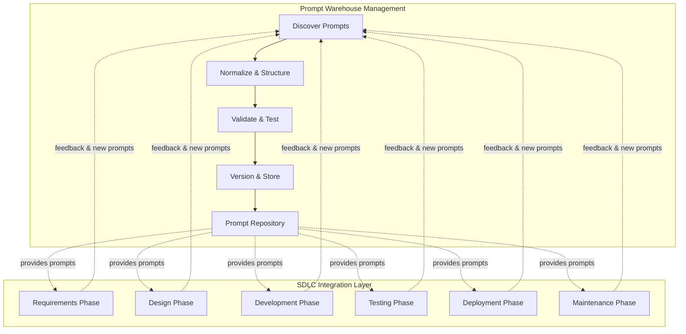
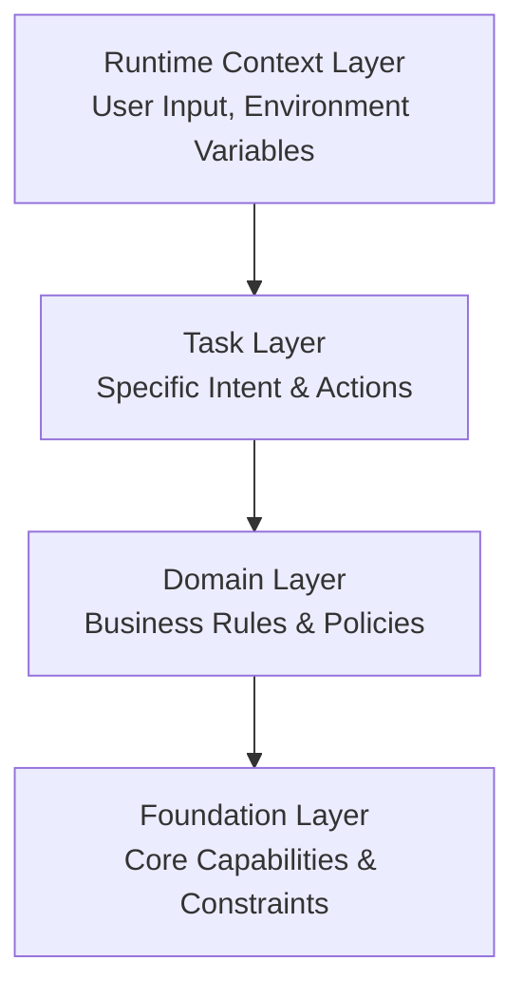
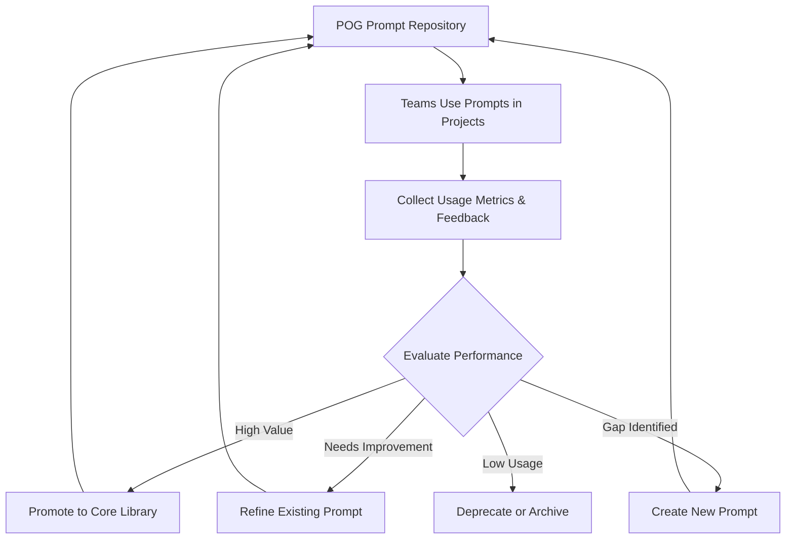

# Prompt Orchestration Governance (POG)

**A Framework for Managing Prompts as First-Class Software Assets Across the SDLC**

Version 1.0 | January 2026

---

## Executive Summary

Large Language Models (LLMs) have transformed how software is developed, yet most organizations lack a structured approach to managing the prompts that drive AI-enabled systems. **Prompt Orchestration Governance (POG)** provides a practical framework for making the Software Development Life Cycle (SDLC) more efficient through structured prompt management and usage.

POG addresses two critical needs:

1. **Prompt Warehouse Management**: A systematic process to discover, normalize, validate, and version prompts as reusable assets
2. **SDLC Integration**: Phase-specific prompts that accelerate each stage of software development—from requirements gathering to maintenance

Rather than treating prompts as ad-hoc inputs, POG positions them as **first-class software assets** that can be discovered, refined, governed, and strategically deployed across the entire software lifecycle.

---

## 1. Problem Statement

### 1.1 The Efficiency Gap in AI-Enabled Development

Modern software development increasingly relies on AI assistance through prompts. However, most organizations face critical challenges:

- **Ad-hoc Prompt Creation**: Teams create prompts informally, resulting in duplicated effort and inconsistent quality
- **Lack of Reusability**: Effective prompts discovered during one project are lost or forgotten in the next
- **No Systematic Discovery**: Organizations lack processes to identify, capture, and refine valuable prompts
- **SDLC Misalignment**: Prompts are not systematically organized by development phase, making them hard to find when needed

### 1.2 The Cost of Unmanaged Prompts

Without structured prompt management:

- **Reduced Efficiency**: Developers reinvent prompts instead of reusing proven ones
- **Inconsistent Quality**: No validation or testing of prompt effectiveness
- **Knowledge Loss**: Institutional knowledge trapped in chat histories or individual notebooks
- **Missed Opportunities**: No feedback loop to improve prompts based on real-world usage

**The core challenge is not AI capability, but the absence of a framework to systematically manage and leverage prompts across the SDLC.**

---

## 2. Prompts as First-Class Software Assets

POG reframes prompts as structured, versioned, and auditable artifacts that deserve the same rigor as source code.

### 2.1 Definition

> **A Prompt** is a structured, versioned artifact that encodes intent, constraints, and context for model-driven execution. It is discoverable, testable, and reusable across projects and teams.

### 2.2 Conceptual Mapping

| Traditional Software | POG Prompt-Centric Systems |
|---------------------|----------------------------|
| Source Code | Prompt Artifact |
| Code Library | Prompt Repository |
| Unit Test | Prompt Evaluation Case |
| Version Control | Prompt Versioning |
| Deployment | Prompt Activation |
| Refactoring | Prompt Normalization |

### 2.3 Prompt Lifecycle Stages

POG recognizes prompts evolve through distinct stages:

1. **Interaction Prompts**: Ad-hoc prompts used in chat or exploration
2. **Discovered Prompts**: Identified as valuable and worth capturing
3. **Normalized Prompts**: Structured, parameterized, and generalized
4. **Validated Prompts**: Tested against evaluation cases
5. **Skill Prompts**: Production-ready, versioned, and governed artifacts

---

## 3. POG Dual Architecture

POG operates through two interconnected functions:

---

## 4. Function 1: Prompt Warehouse Management

The Prompt Warehouse Management function ensures prompts are systematically captured, refined, and maintained.

### 4.1 Discovery Phase

**Goal**: Identify valuable prompts from various sources

**Activities**:
- Monitor chat interactions and exploration sessions
- Collect prompts from completed projects
- Gather community contributions
- Identify gaps in current prompt coverage

**Outputs**: Candidate prompts for normalization

### 4.2 Normalization Phase

**Goal**: Transform ad-hoc prompts into reusable, structured artifacts

**Activities**:
- Extract intent and core logic
- Parameterize variable elements
- Generalize for broader applicability
- Add metadata (purpose, phase, complexity)
- Structure using consistent formats

**Outputs**: Well-formed prompt templates

### 4.3 Validation Phase

**Goal**: Ensure prompt quality and effectiveness

**Activities**:
- Create evaluation test cases
- Test against known inputs/outputs
- Verify prompt behavior consistency
- Assess edge cases and failure modes
- Review for bias, safety, and compliance

**Outputs**: Validated, tested prompts

### 4.4 Versioning & Repository Management

**Goal**: Maintain prompt lifecycle and traceability

**Activities**:
- Assign version numbers
- Categorize by SDLC phase and domain
- Store in centralized repository
- Track usage metrics and feedback
- Deprecate outdated prompts

**Outputs**: Production-ready skill prompts in repository

---

## 5. Function 2: SDLC-Aligned Prompt Library

POG provides phase-specific prompts that accelerate each stage of software development.

### 5.1 Requirements Phase Prompts

**Purpose**: Facilitate requirements gathering, analysis, and documentation

**Prompt Categories**:
- **User Story Elicitation**: Generate user stories from stakeholder interviews
- **Acceptance Criteria Generation**: Define testable acceptance criteria
- **Requirements Validation**: Check completeness and consistency
- **Risk Analysis**: Identify technical and business risks early

**Example Use Case**: When starting a new feature, developers invoke "User Story Generator" prompt to structure stakeholder input into well-formed user stories.

### 5.2 Design Phase Prompts

**Purpose**: Support architecture and detailed design activities

**Prompt Categories**:
- **Architecture Pattern Suggestion**: Recommend suitable architectural patterns
- **API Design**: Generate API specifications and endpoint definitions
- **Data Model Design**: Propose database schemas and relationships
- **Design Review**: Analyze designs for best practices

**Example Use Case**: Developers use "API Design Assistant" prompt to generate RESTful API specifications from functional requirements.

### 5.3 Development Phase Prompts

**Purpose**: Accelerate coding, refactoring, and documentation

**Prompt Categories**:
- **Code Generation**: Create boilerplate and implementation code
- **Code Review**: Analyze code for quality issues
- **Refactoring Suggestions**: Identify improvement opportunities
- **Documentation Generation**: Create inline and external documentation

**Example Use Case**: Developers use "Code Review Assistant" to get suggestions for improving code quality before submitting pull requests.

### 5.4 Testing Phase Prompts

**Purpose**: Enhance test coverage and quality assurance

**Prompt Categories**:
- **Test Case Generation**: Create unit, integration, and E2E test cases
- **Test Data Creation**: Generate realistic test data sets
- **Bug Analysis**: Diagnose and suggest fixes for failures
- **Coverage Analysis**: Identify untested scenarios

**Example Use Case**: QA engineers use "Test Case Generator" to create comprehensive test suites based on requirements and code.

### 5.5 Deployment Phase Prompts

**Purpose**: Streamline release and deployment activities

**Prompt Categories**:
- **Release Notes Generation**: Create user-facing release documentation
- **Deployment Script Review**: Validate deployment configurations
- **Rollback Planning**: Generate rollback procedures
- **Configuration Validation**: Check environment-specific settings

**Example Use Case**: Release managers use "Release Notes Generator" to produce clear, comprehensive release documentation.

### 5.6 Maintenance Phase Prompts

**Purpose**: Support ongoing operations and improvements

**Prompt Categories**:
- **Incident Analysis**: Diagnose production issues
- **Performance Optimization**: Identify bottlenecks and improvements
- **Documentation Updates**: Keep documentation synchronized with changes
- **Technical Debt Assessment**: Evaluate and prioritize refactoring

**Example Use Case**: DevOps teams use "Incident Analyzer" to quickly diagnose root causes during production incidents.

---

## 6. Prompt Orchestration Layers

POG organizes prompts into hierarchical layers to support composition and context management:

### Layer Descriptions

**Foundation Layer**: Core system capabilities, safety constraints, and organizational policies that apply universally.

**Domain Layer**: Business-specific rules, terminology, and patterns relevant to particular domains or industries.

**Task Layer**: Specific intents and actions that accomplish particular development tasks (e.g., "generate unit tests", "review API design").

**Runtime Context Layer**: Dynamic context including user input, project state, environment variables, and session information.

---

## 7. Usage Scenarios

### 7.1 Scenario: Starting a New Project

**Challenge**: Team needs to quickly bootstrap a new web application with clear requirements and solid architecture.

**POG Workflow**:

1. **Requirements Phase**: 
   - Invoke "Stakeholder Interview Guide" prompt to structure stakeholder meetings
   - Use "User Story Generator" to create initial backlog from interview notes
   - Apply "Requirements Validator" to check completeness

2. **Design Phase**:
   - Use "Architecture Pattern Advisor" to select appropriate patterns
   - Apply "API Design Assistant" to define service contracts
   - Invoke "Data Model Designer" to propose database schema

3. **Development Phase**:
   - Use "Code Generator" for boilerplate and common patterns
   - Apply "Code Review Assistant" during development for continuous feedback

4. **Testing Phase**:
   - Invoke "Test Case Generator" to create comprehensive test suites
   - Use "Test Data Creator" for realistic data sets

5. **Deployment Phase**:
   - Apply "Release Notes Generator" to document changes
   - Use "Configuration Validator" to verify deployment settings

**Outcome**: 40% reduction in project setup time, improved consistency, and better documentation from day one.

### 7.2 Scenario: Maintaining Existing Application

**Challenge**: Production incident requires quick diagnosis and fix while maintaining code quality.

**POG Workflow**:

1. **Incident Response**:
   - Invoke "Incident Analyzer" with error logs and metrics
   - Use "Root Cause Diagnostics" to identify issue source

2. **Fix Development**:
   - Apply "Bug Fix Generator" for suggested solutions
   - Use "Code Review Assistant" to validate fix quality

3. **Testing**:
   - Invoke "Regression Test Generator" to prevent similar issues
   - Apply "Test Coverage Analyzer" to ensure adequate coverage

4. **Documentation**:
   - Use "Incident Report Generator" to document resolution
   - Apply "Knowledge Base Update" to capture learnings

**Outcome**: Faster incident resolution, better documentation, and systematic prevention of recurring issues.

---

## 8. Meta-Loop: POG Self-Improvement

POG includes a continuous improvement mechanism for the prompt library itself:

### Meta-Loop Activities

1. **Usage Monitoring**: Track which prompts are used, when, and by whom
2. **Effectiveness Measurement**: Collect feedback on prompt quality and outcomes
3. **Gap Analysis**: Identify missing prompts or underserved SDLC phases
4. **Continuous Refinement**: Update prompts based on real-world usage patterns
5. **Community Contributions**: Enable teams to propose new prompts
6. **Deprecation Management**: Remove outdated or redundant prompts

---

## 9. Governance & Control Plane

### 9.1 Implementation-Agnostic Control Plane

POG is intentionally implementation-agnostic and can be realized through various approaches:

- **GitOps-Based**: Prompts stored as code in Git repositories with PR-based review workflows
- **Platform-Based**: Dedicated prompt management platforms with UI-driven workflows
- **API-Driven**: RESTful APIs for programmatic prompt access and management
- **Hybrid**: Combination of approaches based on organizational needs

### 9.2 Governance Principles

**Versioning**: All prompts maintain version history and change logs

**Access Control**: Role-based access for prompt creation, review, and usage

**Auditability**: Track who used which prompts when and for what purpose

**Quality Gates**: Validation and testing required before promotion to production

**Compliance**: Ensure prompts adhere to organizational policies and regulations

---

## 10. Expected Outcomes

Organizations implementing POG can expect:

### 10.1 Efficiency Gains

- **40-60% reduction** in time spent recreating prompts
- **Faster onboarding** of new team members through standardized prompts
- **Accelerated SDLC phases** with ready-to-use, phase-specific prompts

### 10.2 Quality Improvements

- **Consistent prompt quality** through validation and testing
- **Reduced errors** from using proven, tested prompts
- **Better documentation** generated through standardized prompts

### 10.3 Knowledge Management

- **Institutional knowledge** captured in reusable prompt library
- **Cross-team learning** from shared prompt repository
- **Continuous improvement** through feedback loops

### 10.4 Strategic Advantages

- **Competitive edge** through faster, higher-quality development
- **Scalability** as prompt library grows with organizational experience
- **Innovation enablement** by freeing teams from repetitive prompt creation

---

## 11. Conclusion

**Prompt Orchestration Governance (POG)** transforms prompts from ephemeral, ad-hoc inputs into strategic assets that systematically enhance the Software Development Life Cycle.

By providing both a **Prompt Warehouse Management** function and an **SDLC-Aligned Prompt Library**, POG enables organizations to:

- Capture and refine valuable prompts systematically
- Accelerate every phase of software development
- Build institutional knowledge that compounds over time
- Continuously improve through feedback and measurement

POG is not about replacing traditional SDLC practices or human expertise. Rather, it augments them by providing structured, tested, and proven prompts exactly when and where they're needed.

As AI-enabled development becomes the norm, organizations with robust prompt governance will have a decisive advantage in speed, quality, and innovation.

**The future of software development is not just about having access to AI—it's about systematically leveraging that access through frameworks like POG.**

---

## Appendix: Key Terms

**Interaction Prompt**: An ad-hoc prompt used during exploration or chat interactions.

**Skill Prompt**: A production-ready, versioned, and governed prompt artifact ready for reuse.

**Prompt Discovery**: The process of identifying valuable prompts worth capturing and formalizing.

**Prompt Normalization**: Transforming ad-hoc prompts into structured, parameterized, reusable templates.

**Prompt Validation**: Testing prompts against evaluation cases to ensure quality and consistency.

**SDLC Phase**: A distinct stage in the Software Development Life Cycle (Requirements, Design, Development, Testing, Deployment, Maintenance).

**Prompt Repository**: A centralized, versioned store of governed prompt artifacts.

**Meta-Loop**: The continuous improvement process for the POG prompt library itself.

**Orchestration Layer**: Hierarchical levels (Foundation, Domain, Task, Runtime) that organize prompts by scope and context.

**Control Plane**: The governance mechanisms (versioning, access control, audit) that manage prompt lifecycle.

---

## About the Author

**Ted Enjtorian**  
*Framework Designer & Primary Author*

With over 20 years of experience as a software systems architect, I witnessed a profound shift when LLM-powered coding tools like AI-assisted development emerged. While colleagues wielded these tools like magic to deliver impressive results, I noticed a critical gap: the prompts driving these outcomes remained invisible, undocumented, and unshared. This realization sparked POG, a framework to elevate prompts from ephemeral inputs to first-class artifacts worthy of the same rigor we apply to code itself.

**Connect:**  
- 🔗 LinkedIn: https://tw.linkedin.com/in/enjtorian
- 💻 GitHub: [@enjtorian](https://github.com/enjtorian)

For detailed contributor information and citation guidelines, see [AUTHORS.md](https://github.com/enjtorian/prompt-orchestration-governance-whitepaper/blob/main/AUTHORS.md).

---

*POG Version 1.0 | January 2026*  
*For updates and contributions, visit [GitHub Repository](https://github.com/enjtorian/prompt-orchestration-governance-whitepaper)*

---

**License:** This work is licensed under [CC BY 4.0](https://creativecommons.org/licenses/by/4.0/). You are free to share and adapt with attribution.
