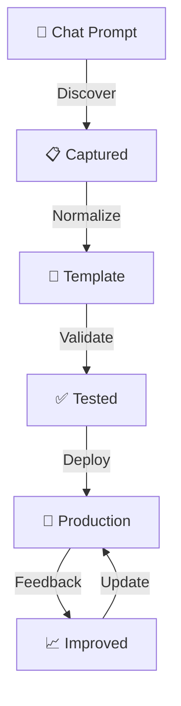

# 5-Minute POG Quick Start

**Reading Time: 5 minutes**

Get up to speed with Prompt Orchestration Governance (POG) quickly. This guide covers the essentials to understand what POG is, why it matters, and how to get started.

---

## What is POG? (30 seconds)

**POG = Prompt Orchestration Governance**

We observe that mature teams often organize prompts in ways similar to how they manage code. POG names that pattern:
- 📦 **Store** prompts as reusable assets
- 🔄 **Version** and track changes
- ✅ **Validate** quality before use
- 🚀 **Share** across teams and projects
- 📊 **Improve** based on usage data

**In one sentence**: POG describes how prompts naturally evolve to resemble professional software artifacts when they're shared at scale.

---

## The Problem POG Addresses (1 minute)

### What We Observe Without Systematic Prompt Management:
```
Developer A: Spends 30 min crafting perfect code review prompt
           ↓
Developer B: Doesn't know it exists, spends 30 min recreating it
           ↓
Developer C: Finds it in Slack, can't tell if it's still current
           ↓
Result: Wasted effort, inconsistent quality, knowledge trapped in chat
```

### With Systematic Prompt Organization:
```
Developer A: Creates prompt → Submits to repository
           ↓
System: Tests, validates, versions the prompt
           ↓
Developers B, C, D: Find it, use it, provide feedback
           ↓
Result: Prompts improve over time, knowledge is shared and compounds
```

**What this means**: When prompts are managed systematically, they become more valuable—not because the method is superior, but because visibility and feedback multiply their usefulness.

---

## How POG Works (2 minutes)

### The POG Lifecycle



**Step by step**:

1. **Discovery**: Identify valuable prompts from daily work
2. **Normalization**: Turn ad-hoc prompts into reusable templates
3. **Validation**: Test against real scenarios
4. **Repository**: Store with version control
5. **Usage**: Teams consume from central library
6. **Improvement**: Collect feedback, iterate

### Two Core Functions

#### 1️⃣ **Prompt Warehouse**
- Like a package registry (npm, PyPI) but for prompts
- Central storage with search and discovery
- Version control and quality gates

#### 2️⃣ **SDLC Integration**
- Prompts organized by development phase
- Requirements → Design → Development → Testing → Deployment → Maintenance
- Right prompt, right time, right phase

---

## Key Concepts (1 minute)

### Interaction vs. Skill Prompts

| Interaction Prompt | Skill Prompt |
|-------------------|--------------|
| 💬 Ad-hoc chat | 📦 Versioned asset |
| 🔓 Ungoverned | 🔐 Governed |
| 👤 Personal | 👥 Shared |
| ⚡ Quick & dirty | ✨ Clean & tested |

**Goal**: Transform interaction prompts into skill prompts.

### The POG Repository

Think of it as:
- **Git repository** for prompt files
- **Database** for metadata and search
- **CI/CD** for validation and deployment
- **Package manager** for distribution

### Example Prompt Flow

```
Before (Interaction):
"Review this code for bugs"

After (Skill Prompt):
Name: "Code Review Assistant v2.1"
Template: "Review the following {{LANGUAGE}} code for {{FOCUS}}:
{{CODE}}

Focus on:
- Security vulnerabilities
- Performance issues  
- Best practices violations"

Metadata: 
- Phase: Development
- Tags: code-review, quality
- Success Rate: 94%
- Used by: 47 developers
```

---

## Getting Started (30 seconds)

### Option 1: Lightweight (1 hour setup)
```bash
# Create Git repo for prompts
mkdir prompt-library
cd prompt-library
git init

# Add your first prompt
mkdir development
echo "# Code Review Prompt" > development/code-review.md
git add . && git commit -m "First prompt"
```

### Option 2: Read More First
- 📖 [Full Documentation](index.md) - Complete framework
- 📊 [See Diagrams](diagrams.md) - Visual overview
- 🎯 [Implementation Guide](recommendations.md) - Step-by-step

### Option 3: Start with Examples
Check the [FAQ](faq.md) for:
- Real-world use cases
- Common questions
- Implementation patterns

---

## When to Use POG

### ✅ Use POG if:
- You have 5+ developers using AI tools
- You're recreating similar prompts repeatedly
- You need to share prompts across teams
- You want consistent quality and governance

### ⚠️ Start smaller if:
- Solo developer or 2-3 person team
- Just starting with AI tools
- Looking for lightweight solution first

**Recommendation**: Start with simple Git-based approach, scale up as needed.

---

## Quick Wins (What to expect)

### Week 1
- ✅ First 10-20 prompts in repository
- ✅ Basic folder structure by SDLC phase
- ✅ Team can search and discover prompts

### Month 1
- ✅ 50+ prompts covering common tasks
- ✅ Developers actively contributing
- ✅ Measurable time savings (2-4 hours/developer/month)

### Month 3
- ✅ 100+ prompts with usage metrics
- ✅ Quality improvements visible
- ✅ New team members onboard faster
- ✅ Strong ROI established

---

## The POG Stack (Simplified)

### Minimum Viable Stack
```
Git Repository (GitHub/GitLab)
    ↓
Markdown Files (prompts as docs)
    ↓
Folder Structure (organized by phase)
    ↓
README (usage guidelines)
```

**Cost**: Free  
**Setup Time**: 1-2 hours  
**Maintenance**: Minimal  

### Enhanced Stack (For Scale)
```
Git Repository (version control)
    ↓
Database (metadata, search)
    ↓
CI/CD Pipeline (validation)
    ↓
Web UI (discovery, analytics)
    ↓
API (programmatic access)
```

**Cost**: $100-1000/month  
**Setup Time**: 1-3 months  
**Maintenance**: 1-2 people  

---

## Common Questions

### "Isn't this just a shared folder?"
No. POG adds:
- ✅ Version control and history
- ✅ Quality validation and testing
- ✅ Usage tracking and improvement
- ✅ Governance and access control
- ✅ Integration with development workflow

### "We already use ChatGPT/Claude"
POG doesn't replace them—it enhances them:
- You still use ChatGPT/Claude to **execute** prompts
- POG helps you **manage, share, and improve** those prompts
- Like Git doesn't replace your code editor—it manages your code

### "How is this different from prompt libraries?"
POG is more comprehensive:
- ❌ Prompt libraries: Collection of example prompts
- ✅ POG: Full lifecycle management with governance

---

## Next Steps

### 🚀 Ready to Start?
1. Read [Implementation Recommendations](recommendations.md)
2. Check [Decision Framework](recommendations.md#decision-framework-should-you-implement-pog)
3. Start with pilot team

### 🤔 Want to Learn More?
1. Review [Detailed Documentation](index.md)
2. Explore [Architecture Diagrams](diagrams.md)
3. Compare with [PDD](comparisons/pdd.md) and [PDE](comparisons/pde.md)

### 💬 Have Questions?
1. Check the [FAQ](faq.md)
2. Review [Glossary](glossary.md) for terms
3. Open a discussion on GitHub

---

## Key Takeaways

🎯 **POG treats prompts as first-class software assets**

📦 **Discover → Normalize → Validate → Share → Improve**

🚀 **Start simple, scale as needed**

⏱️ **Quick wins in weeks, major ROI in months**

🤝 **Complements your existing AI tools, doesn't replace them**

---

**Time invested in this guide**: ~5 minutes  
**Time you'll save with POG**: Hours every month  

**Ready to get started?** Head to the [Implementation Guide](recommendations.md) →

---

*For the complete framework, see the [Main POG Documentation](index.md)*
