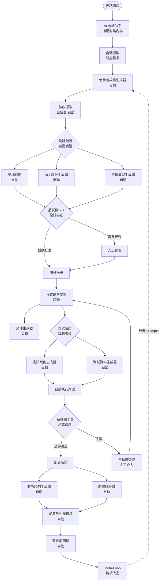
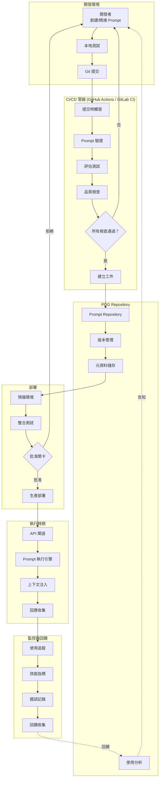
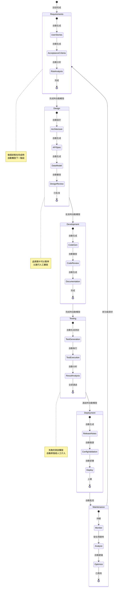
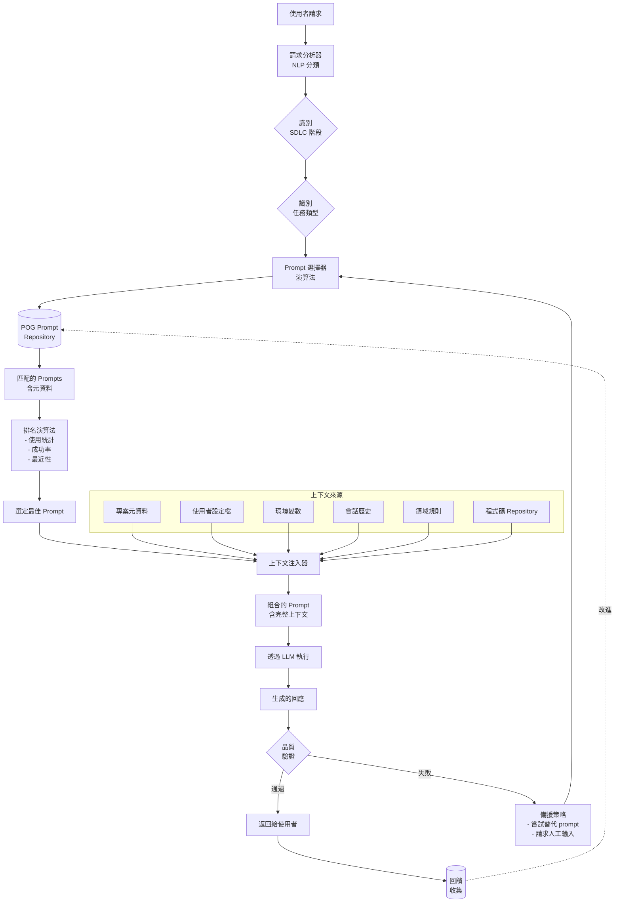
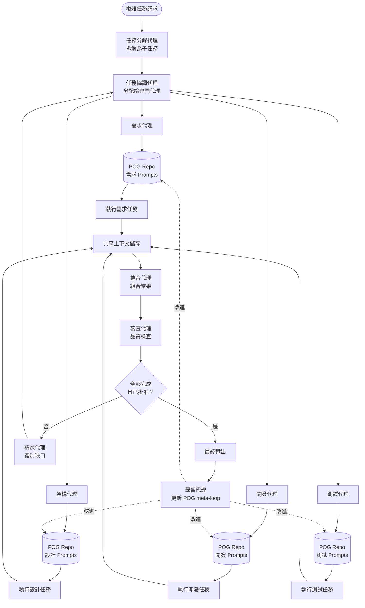

# POG 自動化圖表

本頁包含說明 Prompt Orchestration Governance 框架的自動化工作流程和端到端自動化架構的圖表。

---

## 圖表 7：端到端自動化管線

此圖表展示從需求訪談到部署的完整自動化流程，展示 POG 如何實現全自動化功能開發。

**說明**：此端到端自動化管線展示 POG 如何編排從需求訪談到生產部署的整個功能開發。關鍵自動化點包括：
- 需求的自動提取和結構化
- 自動觸發的 SDLC 階段轉換
- 自動化程式碼生成、測試和部署
- 需要時提供人工監督的品質關卡
- 持續改進的回饋循環

---

## 圖表 8：CI/CD 整合架構

此圖表說明 POG 如何與 CI/CD 管線整合以進行自動化 prompt 部署和執行。

**說明**：此架構展示 POG 與現代 CI/CD 管線的整合：
- **開發**：開發者在本地創建和測試 prompts
- **CI 管線**：自動化驗證、測試和品質檢查
- **POG Repository**：具有版本控制和元資料的集中式儲存
- **部署**：具有批准關卡的分階段推出
- **執行時期**：具有上下文注入的生產執行
- **監控**：持續改進的全面回饋循環

---

## 圖表 9：自動化 SDLC 階段轉換

此圖表展示 POG 如何自動觸發和編排 SDLC 階段之間的轉換。

**說明**：此狀態機說明 POG 的自動化階段轉換：
- 每個 SDLC 階段在完成時自動觸發下一個階段
- 每個階段內的子任務自動執行
- 品質關卡提供人工監督機會
- 失敗觸發適當的介入（自動修復或人工審查）
- 從維護回到需求的持續循環

---

## 圖表 10：智能 Prompt 選擇與上下文注入

此圖表展示 POG 如何在執行時期自動選擇適當的 prompts 並注入上下文。

**說明**：此流程展示 POG 的智能自動化：
- **請求分析**：NLP 分類識別意圖和上下文
- **智能選擇**：演算法將請求匹配到最佳 prompt
- **上下文注入**：自動從多個來源收集和注入相關上下文
- **品質驗證**：確保回應符合品質標準
- **備援處理**：失敗時的自動恢復策略
- **持續學習**：回饋改進未來選擇

---

## 圖表 11：多代理協作工作流程

此圖表說明多個 AI 代理如何在 POG 框架內協作以完成複雜任務。

**說明**：POG 中的多代理協作模式：
- **任務分解**：複雜請求分解為可管理的子任務
- **專門代理**：每個代理專注於特定 SDLC 階段
- **POG 整合**：所有代理利用 repository 中階段適當的 prompts
- **共享上下文**：代理透過共享上下文儲存進行協作
- **品質保證**：審查代理確保連貫性和品質
- **持續學習**：學習代理將洞察回饋到 POG

---

## 自動化最佳實踐

### 1. 人機協作點

雖然 POG 實現廣泛的自動化，但策略性的人工監督至關重要：

- **品質關卡**：設計審查、關鍵安全決策
- **合規檢查**：監管要求、法律審查
- **創意決策**：UX 設計選擇、品牌一致性
- **風險評估**：高影響變更、生產部署

### 2. 備援策略

自動化應包含穩健的備援機制：

- **信心閾值**：將低信心輸出路由到人工審查
- **替代 Prompts**：如果第一次嘗試失敗，嘗試不同的 prompts
- **升級路徑**：當自動化無法繼續時的明確升級
- **手動覆蓋**：始終允許人工介入

### 3. 監控與警報

全面監控確保自動化健康：

- **成功率**：追蹤自動化成功與備援率
- **效能指標**：監控延遲、成本、品質
- **異常檢測**：對異常模式或錯誤發出警報
- **回饋循環**：基於結果的持續改進

---

## 實施考量

### 逐步自動化採用

1. **階段 1：使用 POG 手動操作**：手動使用 POG prompts
2. **階段 2**：自動化簡單、低風險任務
3. **階段 3**：添加 CI/CD 整合
4. **階段 4**：實施階段自動轉換
5. **階段 5**：具有監督的完整端到端自動化

### 技術需求

- **編排平台**：Airflow、Temporal 或自訂
- **CI/CD 系統**：GitHub Actions、GitLab CI、Jenkins
- **API 閘道**：用於執行時期 prompt 執行
- **監控堆疊**：Prometheus、Grafana、ELK
- **儲存**：Git + 資料庫用於 prompt repository

### 安全與合規

- **存取控制**：基於角色的自動化觸發存取
- **稽核軌跡**：自動化操作的完整記錄
- **機密管理**：憑證的安全處理
- **合規性**：確保自動化流程符合監管要求

---

*返回[主要文件](index.md) | [圖表](diagrams.md)*
