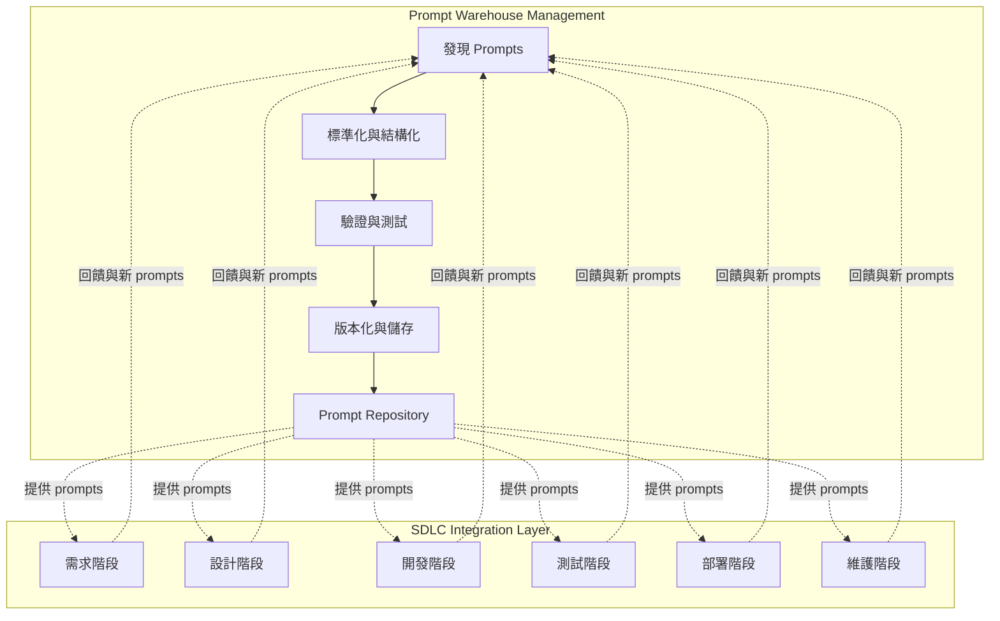
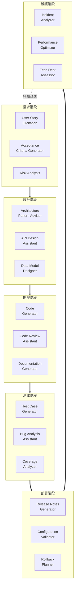
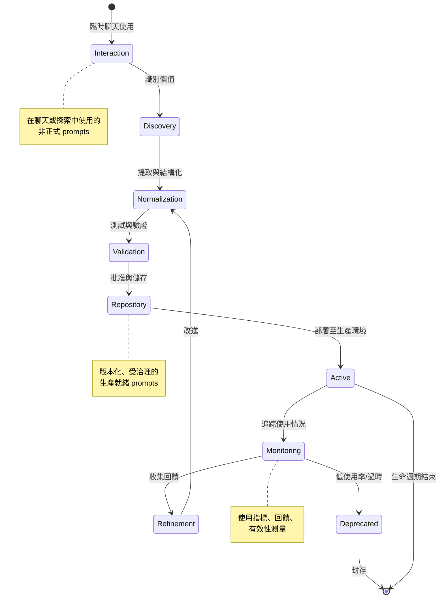
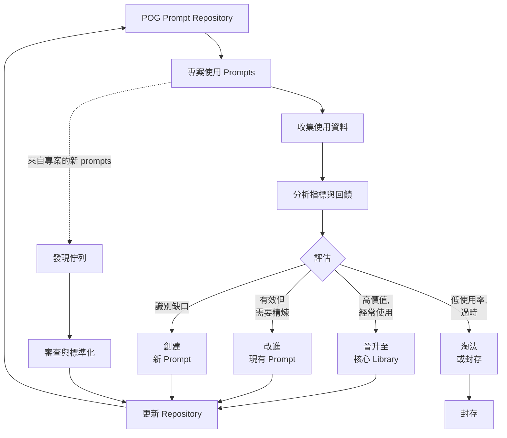
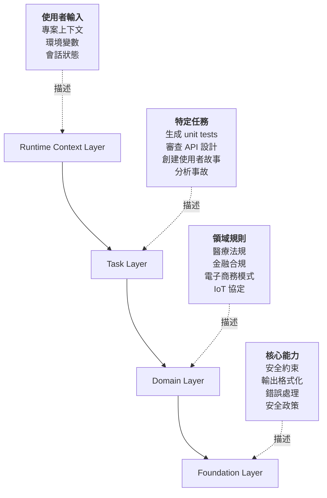
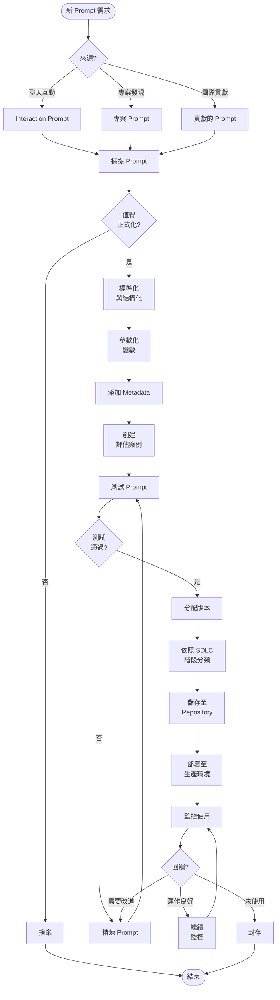

# POG 圖表

本頁包含 Prompt Orchestration Governance 框架的所有視覺化圖表。

---

## 圖表 1：POG 雙重架構概覽

此圖表說明 POG 的兩個核心功能：Prompt Warehouse Management 與 SDLC Integration。

**說明**：Prompt Warehouse Management 功能發現、標準化、驗證和儲存 prompts。SDLC Integration Layer 為軟體開發的每個階段提供針對特定階段的 prompts。來自 SDLC 使用的回饋持續改進 prompt repository。

---

## 圖表 2：SDLC 階段 Prompt 流程

此圖表展示在每個 SDLC 階段調用的不同 prompts 及具體範例。

**說明**：每個 SDLC 階段都有專門的 prompt 類別來滿足特定需求。這個循環是持續的，維護階段的洞察回饋到下一次迭代的需求階段。

---

## 圖表 3：Prompt 生命週期狀態機

此圖表說明 prompts 如何從臨時互動演進為生產就緒的 skill prompts。

**說明**：Prompts 從非正式互動開始，經過發現和標準化，得到驗證，並成為生產就緒的 skill prompts。持續監控使精煉成為可能，當不再有用時可以淘汰 prompts。

---

## 圖表 4：Meta-Loop - POG 自我改進

此圖表展示 POG 如何透過回饋和使用分析持續改進自己的 prompt library。

**說明**：POG 實施了一個 meta-loop，持續監控、分析 prompt 使用情況並回饋到 repository。高價值的 prompts 被晉升，現有的 prompts 被精煉，缺口觸發新 prompt 的創建，低價值的 prompts 被淘汰。這確保 prompt library 隨著組織需求而演進。

---

## 圖表 5：Orchestration 層級架構

此圖表展示依照範圍和上下文組織 prompts 的階層式層級。

**說明**：Prompts 以階層式層級組織，從基礎系統能力到執行期特定的上下文。每一層都建立在下層之上：

- **Foundation Layer**：普遍適用的系統政策和約束
- **Domain Layer**：特定業務的規則和模式
- **Task Layer**：特定的開發任務和意圖
- **Runtime Context Layer**：動態的、會話特定的資訊

這種分層使 prompt 組合和上下文管理成為可能。

---

## 圖表 6：Prompt 生命週期流程（詳細版）

此圖表提供了 prompt 管理生命週期的詳細視圖，包含決策點。

**說明**：這個詳細流程展示了 prompt 從識別到部署和監控的完整旅程，包括品質門檻和決策點，確保只有有價值、經過測試的 prompts 進入生產環境。

---

*更多資訊，請參閱[主白皮書](index.md)。*
