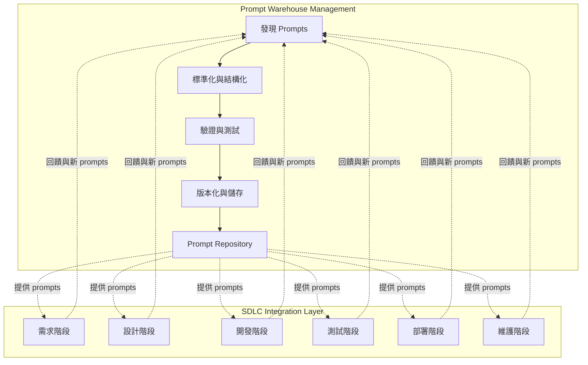
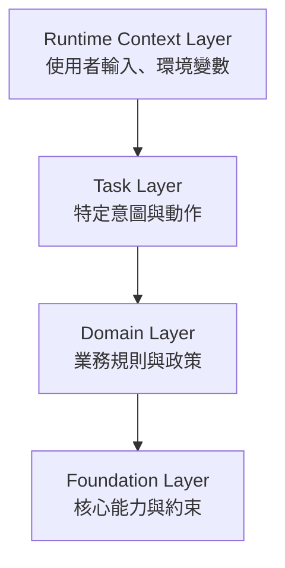
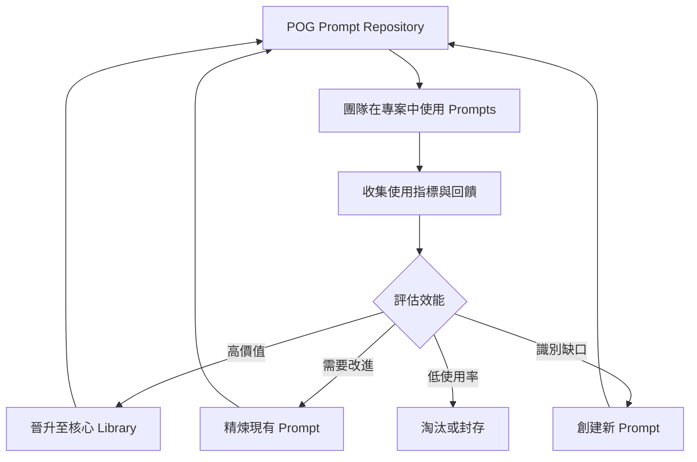

# Prompt Orchestration Governance (POG)

**將 Prompt 作為一級軟體資產進行管理的跨 SDLC 框架**

Version 1.0 | January 2026

---

## 執行摘要

大型語言模型（Large Language Models, LLMs）已經改變了軟體開發的方式，但大多數組織缺乏結構化的方法來管理驅動 AI 系統的 prompts。**Prompt Orchestration Governance (POG)** 提供了一個實用框架，透過結構化的 prompt 管理和使用，讓軟體開發生命週期（Software Development Life Cycle, SDLC）更有效率。

POG 解決兩個關鍵需求：

1. **Prompt Warehouse Management**：系統化流程來發現、標準化、驗證和版本化 prompts 作為可重複使用的資產
2. **SDLC Integration**：針對特定階段的 prompts，加速軟體開發的每個階段—從需求收集到維護

POG 不將 prompts 視為臨時輸入，而是將其定位為**一級軟體資產**，可以被發現、精煉、治理，並策略性地部署在整個軟體生命週期中。

---

## 範圍與意圖

本論文**不是**試圖標準化 prompt 實踐，也不提議替代現有的工程或治理模型。相反，它命名了一個缺失的層級，只有當 prompts 被共享、重複使用和規模化運作時，這個層級才會變得可見。

許多團隊—獨立地、無需協調—會匯聚於相似的 prompt 管理模式。本論文提供了一個透鏡來推理這些模式，而不是規定它們必須如何樣子。如果你的經驗與此處描述的不同，那個差異本身是寶貴的訊號，說明模型需要如何演化。

---

## 1. 問題陳述

### 1.1 AI 賦能開發中的碎片化模式

現代軟體開發越來越依賴透過 prompts 的 AI 協助。我們觀察到的不是組織「缺乏」什麼—而是獨立運作的團隊已經匯聚於相似的挑戰：

- **分散的 Prompts**：有效的 prompts 從專案和對話中浮現，但仍被困在聊天記錄或本機筆記中
- **重新實現迴圈**：每個團隊獨立地重新發現相似的模式，因為沒有共同的詞彙來辨認並重複使用它們
- **隱藏的機構知識**：寶貴的模式確實存在，但未被系統化地揭示或命名
- **階段不對齊**：團隊常發現 prompts 分散在不同的上下文中，導致新階段開始時難以定位

### 1.2 碎片化為什麼讓組織付出代價

這個成本不是源於團隊在處理 prompts 時的根本方法不匹配。相反，摩擦來自於：

- **缺乏共同詞彙**：團隊發現相似的模式但用不同的名稱，所以每個團隊將其解決方案視為特定於上下文而非可重複使用的
- **隱含與顯式**：有效的模式通常是隱含的—嵌入在對話、經驗或個人實踐中—難以提取
- **隔離**：沒有結構化方式來揭示有價值的 prompts，一個專案的學習無法系統化地轉移到下一個專案
- **沒有回饋迴圈**：在某個上下文中運作良好的 prompts 沒有路徑被精煉、測試，並返回給其他團隊

**挑戰不在於團隊做錯了什麼。挑戰在於缺乏一個共同語言和機制來命名和重複使用他們已經做得很好的東西。**

---

## 2. Prompts 作為一級軟體資產

POG 命名了我們在成熟團隊中觀察到的一個模式：曾經被認為有價值足以重複使用的 prompts，自然演化為類似一級軟體工件的形式—結構化、版本化、可審計。

### 2.1 觀察

> **我們在實踐中看到的**：當團隊從單一專案探索擴展到多團隊編排時，最初是臨時的 prompts 逐漸變得結構化。它們獲得版本、元資料和測試案例。它們從聊天上下文移動到儲存庫。這不是一個規定—它是當 prompts 開始被共享和規模化運作時自然浮現的。

### 2.2 我們認可的模式

當 prompts 跨越從單一使用到共享的閾值時，團隊自然地以類似於管理程式碼的方式組織它們：

| 團隊已在做的事 | 我們如何命名它 |
|---------------------|-------|
| 製作可重複使用的 prompt 文本 | Prompt Artifact |
| 在一個地方收集運作良好的 prompts | Prompt Repository |
| 根據已知案例測試 prompts | Prompt Evaluation Case |
| 隨著時間追蹤 prompts 的更改 | Prompt Versioning |
| 將 prompts 移入生產使用 | Prompt Activation |
| 簡化和通用化 prompts | Prompt Normalization |

這個映射不是「你應該怎麼做」。而是「我們觀察到當團隊在規模化時做什麼」。

### 2.3 Prompt 演化：自然的進展

我們觀察到 prompts 在從實驗性移向運作性時遵循相當一致的軌跡：

1. **Interaction Prompts**：在對話或探索中浮現；無系統的
2. **Discovered Prompts**：被認可為有價值；有人決定保留它
3. **Normalized Prompts**：提取、參數化、比原始上下文更通用
4. **Validated Prompts**：針對已知案例測試；根據結果精煉
5. **Skill Prompts**：準備好生產重複使用；版本化，具有清晰的元資料

並非所有 prompts 都應遵循此路徑—許多在第 1 階段是有用的。這些階段描述我們看到的，而非每個 prompt 必須成為的。

---

## 3. POG 雙重架構

POG 透過兩個相互連接的功能運作：

---

## 4. 功能一：Prompt Warehouse Management

Prompt Warehouse Management 功能確保 prompts 被系統化地捕捉、精煉和維護。

### 4.1 發現階段

**目標**：從各種來源識別有價值的 prompts

**活動**：
- 監控聊天互動和探索會話
- 從已完成的專案中收集 prompts
- 收集社群貢獻
- 識別當前 prompt 覆蓋範圍的缺口

**輸出**：候選 prompts 以供標準化

### 4.2 標準化階段

**目標**：將臨時 prompts 轉換為可重複使用的結構化工件

**活動**：
- 提取意圖和核心邏輯
- 參數化可變元素
- 泛化以提高適用性
- 添加 metadata（目的、階段、複雜度）
- 使用一致格式進行結構化

**輸出**：格式良好的 prompt 模板

### 4.3 驗證階段

**目標**：確保 prompt 品質和有效性

**活動**：
- 創建評估測試案例
- 針對已知輸入/輸出進行測試
- 驗證 prompt 行為一致性
- 評估邊界情況和失效模式
- 審查偏見、安全性和合規性

**輸出**：已驗證、已測試的 prompts

### 4.4 版本化與 Repository 管理

**目標**：維護 prompt 生命週期和可追溯性

**活動**：
- 分配版本號
- 依照 SDLC 階段和領域分類
- 儲存在集中式 repository 中
- 追踪使用指標和回饋
- 淘汰過時的 prompts

**輸出**：在 repository 中生產就緒的 skill prompts

---

*注意：這個模型描述了我們觀察到的模式，而非規定。小型團隊、探索性工作流程和結構化程度較低的上下文可能不需要所有這些階段。該框架是描述性的，而非規範性的。*

---

## 5. 功能二：SDLC 對齊的 Prompt Library

POG 提供針對特定階段的 prompts，加速軟體開發的每個階段。

### 5.1 需求階段 Prompts

**目的**：促進需求收集、分析和文件化

**Prompt 類別**：
- **User Story Elicitation**：從利害關係人訪談中生成使用者故事
- **Acceptance Criteria Generation**：定義可測試的驗收標準
- **Requirements Validation**：檢查完整性和一致性
- **Risk Analysis**：及早識別技術和業務風險

**範例使用情境**：啟動新功能時，開發者調用「User Story Generator」prompt 將利害關係人輸入結構化為格式良好的使用者故事。

### 5.2 設計階段 Prompts

**目的**：支援架構和詳細設計活動

**Prompt 類別**：
- **Architecture Pattern Suggestion**：推薦合適的架構模式
- **API Design**：生成 API 規格和端點定義
- **Data Model Design**：提議資料庫架構和關係
- **Design Review**：分析設計是否遵循最佳實踐

**範例使用情境**：開發者使用「API Design Assistant」prompt 從功能需求生成 RESTful API 規格。

### 5.3 開發階段 Prompts

**目的**：加速編碼、重構和文件化

**Prompt 類別**：
- **Code Generation**：創建樣板和實作程式碼
- **Code Review**：分析程式碼品質問題
- **Refactoring Suggestions**：識別改進機會
- **Documentation Generation**：創建內部和外部文件

**範例使用情境**：開發者使用「Code Review Assistant」在提交 pull request 前獲得改進程式碼品質的建議。

### 5.4 測試階段 Prompts

**目的**：提升測試覆蓋率和品質保證

**Prompt 類別**：
- **Test Case Generation**：創建 unit、integration 和 E2E test cases
- **Test Data Creation**：生成真實的測試資料集
- **Bug Analysis**：診斷並建議失敗的修復方案
- **Coverage Analysis**：識別未測試的場景

**範例使用情境**：QA 工程師使用「Test Case Generator」根據需求和程式碼創建全面的測試套件。

### 5.5 部署階段 Prompts

**目的**：簡化發布和部署活動

**Prompt 類別**：
- **Release Notes Generation**：創建面向使用者的發布文件
- **Deployment Script Review**：驗證部署配置
- **Rollback Planning**：生成回滾程序
- **Configuration Validation**：檢查環境特定設定

**範例使用情境**：發布經理使用「Release Notes Generator」產生清晰、全面的發布文件。

### 5.6 維護階段 Prompts

**目的**：支援持續營運和改進

**Prompt 類別**：
- **Incident Analysis**：診斷生產問題
- **Performance Optimization**：識別瓶頸和改進點
- **Documentation Updates**：保持文件與變更同步
- **Technical Debt Assessment**：評估和優先處理重構

**範例使用情境**：DevOps 團隊使用「Incident Analyzer」在生產事故期間快速診斷根本原因。

---

## 6. Prompt Orchestration 層級

POG 將 prompts 組織成階層式層級，以支援組合和上下文管理：

### 層級描述

**Foundation Layer**：核心系統能力、安全約束和普遍適用的組織政策。

**Domain Layer**：特定業務領域或產業相關的業務規則、術語和模式。

**Task Layer**：完成特定開發任務的具體意圖和動作（例如「生成 unit tests」、「審查 API 設計」）。

**Runtime Context Layer**：動態上下文，包括使用者輸入、專案狀態、環境變數和會話資訊。

---

*注意：這種分層是組織 prompts 的一種方式—而非唯一的方式。某些組織可能使用不同的抽象層級，那也同樣有效。重要的是認識到，當不同團隊在不同層級上推理時，不對齊經常發生。*

---

## 7. 使用場景

### 7.1 場景：啟動新專案

**挑戰**：團隊需要快速啟動一個新的 Web 應用程式，具備清晰的需求和穩固的架構。

**POG 工作流程**：

1. **需求階段**： 
   - 調用「Stakeholder Interview Guide」prompt 來結構化利害關係人會議
   - 使用「User Story Generator」從訪談筆記創建初始待辦事項清單
   - 應用「Requirements Validator」檢查完整性

2. **設計階段**：
   - 使用「Architecture Pattern Advisor」選擇適當的模式
   - 應用「API Design Assistant」定義服務契約
   - 調用「Data Model Designer」提議資料庫架構

3. **開發階段**：
   - 使用「Code Generator」產生樣板和常見模式
   - 在開發期間應用「Code Review Assistant」以獲得持續回饋

4. **測試階段**：
   - 調用「Test Case Generator」創建全面的測試套件
   - 使用「Test Data Creator」產生真實的資料集

5. **部署階段**：
   - 應用「Release Notes Generator」記錄變更
   - 使用「Configuration Validator」驗證部署設定

**成果**：專案設置時間減少 40%，改善一致性，從第一天起就有更好的文件。

### 7.2 場景：維護現有應用程式

**挑戰**：生產事故需要快速診斷和修復，同時維持程式碼品質。

**POG 工作流程**：

1. **事故響應**：
   - 使用錯誤日誌和指標調用「Incident Analyzer」
   - 使用「Root Cause Diagnostics」識別問題來源

2. **修復開發**：
   - 應用「Bug Fix Generator」獲取建議解決方案
   - 使用「Code Review Assistant」驗證修復品質

3. **測試**：
   - 調用「Regression Test Generator」防止類似問題
   - 應用「Test Coverage Analyzer」確保充分覆蓋

4. **文件化**：
   - 使用「Incident Report Generator」記錄解決方案
   - 應用「Knowledge Base Update」捕捉學習成果

**成果**：更快的事故解決、更好的文件，以及系統化預防重複問題。

---

## 8. Meta-Loop：POG 自我改進

POG 包含一個持續改進機制用於 prompt library 本身：

### Meta-Loop 活動

1. **使用監控**：追踪哪些 prompts 被使用、何時使用、由誰使用
2. **有效性測量**：收集關於 prompt 品質和成果的回饋
3. **缺口分析**：識別缺少的 prompts 或服務不足的 SDLC 階段
4. **持續精煉**：根據實際使用模式更新 prompts
5. **社群貢獻**：使團隊能夠提議新的 prompts
6. **淘汰管理**：移除過時或冗餘的 prompts

---

*注意：我們不聲稱此回饋迴圈將在所有組織上下文中運作相同。評估、精煉和晉升發生方式的細節可能差異很大—而且這些變異本身是值得分享的數據。*

---

## 9. 治理與 Control Plane

### 9.1 實作無關的 Control Plane

POG 刻意保持實作無關，可以透過各種方法實現：

- **基於 GitOps**：Prompts 以程式碼形式儲存在 Git repositories 中，使用基於 PR 的審查工作流程
- **基於平台**：專用的 prompt 管理平台，具有 UI 驅動的工作流程
- **API 驅動**：用於程式化 prompt 存取和管理的 RESTful APIs
- **混合式**：根據組織需求結合多種方法

### 9.2 治理原則

**版本化**：所有 prompts 維護版本歷史和變更日誌

**存取控制**：基於角色的 prompt 創建、審查和使用權限

**可審計性**：追踪誰在何時為何目的使用了哪些 prompts

**品質門檻**：晉升至生產前需要驗證和測試

**合規性**：確保 prompts 遵守組織政策和法規

---

## 10. 預期成果

實施 POG 的組織可以預期：

### 10.1 效率提升

- **減少 40-60%** 重新創建 prompts 的時間
- 透過標準化 prompts **加速新成員入職**
- 使用現成的、針對特定階段的 prompts **加速 SDLC 各階段**

### 10.2 品質改善

- 透過驗證和測試實現**一致的 prompt 品質**
- 使用經過驗證的 prompts **減少錯誤**
- 透過標準化 prompts 生成**更好的文件**

### 10.3 知識管理

- **機構知識**捕捉在可重複使用的 prompt library 中
- 從共享的 prompt repository 實現**跨團隊學習**
- 透過回饋循環實現**持續改進**

### 10.4 策略優勢

- 透過更快、更高品質的開發獲得**競爭優勢**
- 隨著組織經驗累積，prompt library 成長帶來**可擴展性**
- 透過將團隊從重複的 prompt 創建中解放出來實現**創新賦能**

---

## 11. 結論

**Prompt Orchestration Governance (POG)** 命名了組織發現的一個模式—通常是追溯地—一旦 prompts 開始被共享、重複使用和規模化運作時。

本論文不是一個規定。它是一個透鏡來思考你可能已經在做的事。

### 我們觀察到的

在 prompt 實踐中成熟的團隊自然地匯聚於相似的模式：他們創建清單、版本化他們的 prompts、測試它們，並將它們整合到 SDLC 工作流程中。這種匯聚不是協調的—它獨立地跨組織發生，因為根本問題是普遍的。

### 本論文所做的事

POG 命名那個匯聚。它提供了一個共同的詞彙，所以當一個團隊說「Skill Prompt」，另一個說「生產就緒的模板」時，他們認識到他們在談論同一件事。僅僅那個命名—沒有任何框架，沒有任何規定—就減少了重新發明，加速了知識轉移。

### 本論文不做的事

- 它不規定*如何*你的 prompts 必須被儲存、版本化或存取
- 它不聲稱完整性；此模型中的缺口是不可避免的
- 它不替代在你的上下文中實現這些想法所需的人類判斷
- 它不平等地適用於所有團隊；小型團隊、探索性上下文和較低關鍵性的工作流程可能有不同的需求

### 一個邀請

如果你的經驗與此處描述的不同—如果你發現了與此模型矛盾的模式，或我們未命名的缺口—**那個差異本身是有價值的**。它意味著模型需要演化。我們邀請你貢獻這些觀察。

像這樣的框架的權威性不來自於「正確」。它來自於「有用」—來自於幫助你認識和命名已經在發生的事，以及隨著不同視角的加入而隨著時間改進。

**最有用的框架不是告訴你該做什麼的框架。而是幫助你向他人解釋你已經在做什麼的框架。**

---

## 附錄 A：常見問題與說明

### 「這不就是 prompts 的版本控制嗎？」

不完全是。版本控制是我們所描述的*一部分*，但 POG 更廣泛。它包括發現、標準化、驗證和跨 SDLC 階段的組織。某些組織可能透過 Git 實現 POG；其他透過專門的平台。模式本身與工具無關。

### 「每個 prompt 都需要經歷全部五個生命週期階段嗎？」

不。生命週期階段描述了我們在 prompts 成熟以進行生產重複使用時觀察到的情況。許多 prompts 在第 1 階段（互動）是有價值的，應該保留在那裡。該框架幫助你認識*何時*一個 prompt 應該移動到下一階段—而非強制所有 prompts 經歷所有階段。

### 「這聽起來像是更多的流程開銷。」

如果實施不當可能是。但大多數成熟的團隊已經以非正式方式做這些事。POG 命名你可能已經在做的事，使其可見且可分享。目標是*減少*重新發明，而非增加官僚制度。

### 「如果我們的組織太小怎麼辦？」

POG 描述了規模化時可見的模式。在探索性專案上工作的小型團隊可能不需要所有組件。這不是框架的失敗—這是認識到不同上下文有不同需求的體現。POG 在你達到 prompts 被跨團隊或專案共享的點時很有用。

### 「這不需要特定的工具或平台嗎？」

不。POG 是實作無關的。你可以用 Git、專用平台、簡單的試算表或多種方法的組合來實現它。模式很重要；工具是一個選擇。

---

## 附錄 B：關鍵術語

**Interaction Prompt**：在探索或聊天互動期間使用的臨時 prompt。

**Skill Prompt**：生產就緒、版本化、受治理的 prompt 工件，可供重複使用。

**Prompt Discovery**：識別值得捕捉和正式化的有價值 prompts 的過程。

**Prompt Normalization**：將臨時 prompts 轉換為結構化、參數化、可重複使用模板的過程。

**Prompt Validation**：針對評估案例測試 prompts 以確保品質和一致性的過程。

**SDLC Phase**：軟體開發生命週期中的不同階段（需求、設計、開發、測試、部署、維護）。

**Prompt Repository**：受治理的 prompt 工件的集中式、版本化儲存庫。

**Meta-Loop**：POG prompt library 本身的持續改進過程。

**Orchestration Layer**：依照範圍和上下文組織 prompts 的階層式層級（Foundation、Domain、Task、Runtime）。

**Control Plane**：管理 prompt 生命週期的治理機制（版本化、存取控制、審計）。

---

## 關於作者

**Ted Enjtorian**  
*框架觀察者與主要作者*

作為一名擁有 20 多年經驗的軟體系統架構師，我有機會第一線觀察團隊如何組織他們的工作。當 LLM 驅動的編碼工具出現時，我注意到了一些事情：同事們正在用 prompts 做出令人印象深刻的事，但那些 prompts 仍然不可見、未記錄且未被重複使用。

本論文不是發明。它是試圖命名我所觀察到發生的事—通常是獨立地—跨團隊和組織。這裡描述的模式並不新穎；隨著更多團隊跨越 prompts 成為共享資產的閾值，它們只是變得更可見。

POG 來自於觀察團隊解決相似的問題、使用相似的方法，但用不同的名字稱呼它們。如果該框架幫助你認識和命名你已經在做的事，並加速與做相同事情的他人的對話—那麼它就成功了。

**聯繫方式:**  
- 🔗 LinkedIn: https://tw.linkedin.com/in/enjtorian
- 💻 GitHub: [@enjtorian](https://github.com/enjtorian)

完整貢獻者資訊和引用指南,請參閱 [AUTHORS.md](https://github.com/enjtorian/prompt-orchestration-governance-whitepaper/blob/main/AUTHORS.md)。

---

*POG Version 1.0 | January 2026*  
*更新與貢獻,請訪問 [GitHub Repository](https://github.com/enjtorian/prompt-orchestration-governance-whitepaper)*

---

**授權:** 本作品採用 [CC BY 4.0](https://creativecommons.org/licenses/by/4.0/) 授權。您可以自由分享和改編,但需註明出處。
