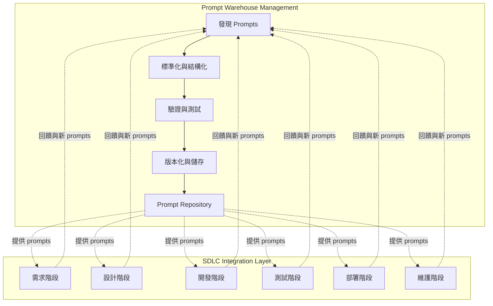
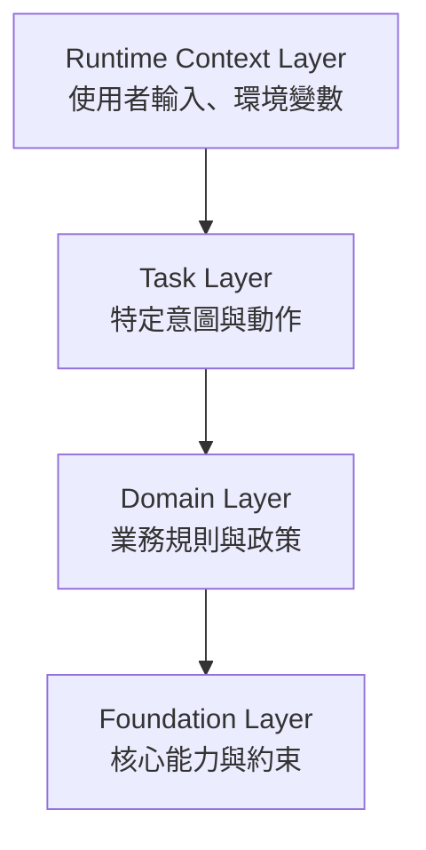
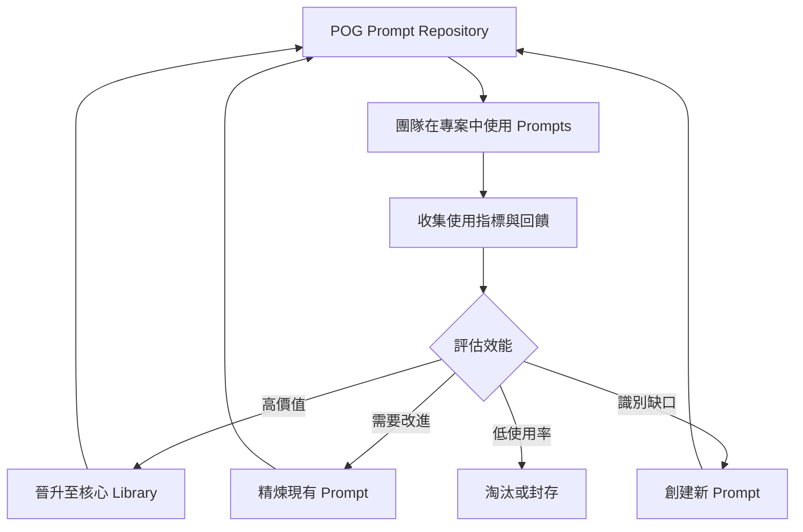

# Prompt Orchestration Governance (POG)

**將 Prompt 作為一級軟體資產進行管理的跨 SDLC 框架**

Version 1.0 | January 2026

---

## 執行摘要

大型語言模型（Large Language Models, LLMs）已經改變了軟體開發的方式，但大多數組織缺乏結構化的方法來管理驅動 AI 系統的 prompts。**Prompt Orchestration Governance (POG)** 提供了一個實用框架，透過結構化的 prompt 管理和使用，讓軟體開發生命週期（Software Development Life Cycle, SDLC）更有效率。

POG 解決兩個關鍵需求：

1. **Prompt Warehouse Management**：系統化流程來發現、標準化、驗證和版本化 prompts 作為可重複使用的資產
2. **SDLC Integration**：針對特定階段的 prompts，加速軟體開發的每個階段—從需求收集到維護

POG 不將 prompts 視為臨時輸入，而是將其定位為**一級軟體資產**，可以被發現、精煉、治理，並策略性地部署在整個軟體生命週期中。

---

## 1. 問題陳述

### 1.1 AI 賦能開發中的效率落差

現代軟體開發越來越依賴透過 prompts 的 AI 協助。然而，大多數組織面臨關鍵挑戰：

- **臨時性 Prompt 創建**：團隊以非正式方式創建 prompts，導致重複工作和品質不一致
- **缺乏可重複使用性**：在某個專案中發現的有效 prompts 在下一個專案中遺失或被遺忘
- **無系統化發現機制**：組織缺乏識別、捕捉和精煉有價值 prompts 的流程
- **與 SDLC 不對齊**：Prompts 未依照開發階段系統化組織，導致需要時難以找到

### 1.2 未管理 Prompts 的成本

缺乏結構化的 prompt 管理會導致：

- **效率降低**：開發者重新發明 prompts 而非重複使用已驗證的版本
- **品質不一致**：沒有驗證或測試 prompt 的有效性
- **知識流失**：機構知識被困在聊天記錄或個人筆記中
- **錯失機會**：沒有回饋循環來根據實際使用情況改進 prompts

**核心挑戰不在於 AI 能力，而在於缺乏一個框架來系統化管理和利用跨 SDLC 的 prompts。**

---

## 2. Prompts 作為一級軟體資產

POG 將 prompts 重新定義為結構化、版本化、可審計的工件，應獲得與原始碼相同的嚴謹對待。

### 2.1 定義

> **Prompt** 是一個結構化、版本化的工件，編碼了意圖、約束和上下文以供模型驅動執行。它是可發現、可測試、可在專案和團隊間重複使用的。

### 2.2 概念映射

| 傳統軟體 | POG Prompt 中心化系統 |
|---------------------|----------------------------|
| 原始碼 | Prompt Artifact |
| 程式碼庫 | Prompt Repository |
| Unit Test | Prompt Evaluation Case |
| 版本控制 | Prompt Versioning |
| 部署 | Prompt Activation |
| 重構 | Prompt Normalization |

### 2.3 Prompt 生命週期階段

POG 認識到 prompts 經歷不同的階段演進：

1. **Interaction Prompts**：在聊天或探索中使用的臨時 prompts
2. **Discovered Prompts**：被識別為有價值且值得捕捉的 prompts
3. **Normalized Prompts**：結構化、參數化、通用化的 prompts
4. **Validated Prompts**：根據評估案例測試過的 prompts
5. **Skill Prompts**：生產就緒、版本化、受治理的工件

---

## 3. POG 雙重架構

POG 透過兩個相互連接的功能運作：

---

## 4. 功能一：Prompt Warehouse Management

Prompt Warehouse Management 功能確保 prompts 被系統化地捕捉、精煉和維護。

### 4.1 發現階段

**目標**：從各種來源識別有價值的 prompts

**活動**：
- 監控聊天互動和探索會話
- 從已完成的專案中收集 prompts
- 收集社群貢獻
- 識別當前 prompt 覆蓋範圍的缺口

**輸出**：候選 prompts 以供標準化

### 4.2 標準化階段

**目標**：將臨時 prompts 轉換為可重複使用的結構化工件

**活動**：
- 提取意圖和核心邏輯
- 參數化可變元素
- 泛化以提高適用性
- 添加 metadata（目的、階段、複雜度）
- 使用一致格式進行結構化

**輸出**：格式良好的 prompt 模板

### 4.3 驗證階段

**目標**：確保 prompt 品質和有效性

**活動**：
- 創建評估測試案例
- 針對已知輸入/輸出進行測試
- 驗證 prompt 行為一致性
- 評估邊界情況和失效模式
- 審查偏見、安全性和合規性

**輸出**：已驗證、已測試的 prompts

### 4.4 版本化與 Repository 管理

**目標**：維護 prompt 生命週期和可追溯性

**活動**：
- 分配版本號
- 依照 SDLC 階段和領域分類
- 儲存在集中式 repository 中
- 追踪使用指標和回饋
- 淘汰過時的 prompts

**輸出**：在 repository 中生產就緒的 skill prompts

---

## 5. 功能二：SDLC 對齊的 Prompt Library

POG 提供針對特定階段的 prompts，加速軟體開發的每個階段。

### 5.1 需求階段 Prompts

**目的**：促進需求收集、分析和文件化

**Prompt 類別**：
- **User Story Elicitation**：從利害關係人訪談中生成使用者故事
- **Acceptance Criteria Generation**：定義可測試的驗收標準
- **Requirements Validation**：檢查完整性和一致性
- **Risk Analysis**：及早識別技術和業務風險

**範例使用情境**：啟動新功能時，開發者調用「User Story Generator」prompt 將利害關係人輸入結構化為格式良好的使用者故事。

### 5.2 設計階段 Prompts

**目的**：支援架構和詳細設計活動

**Prompt 類別**：
- **Architecture Pattern Suggestion**：推薦合適的架構模式
- **API Design**：生成 API 規格和端點定義
- **Data Model Design**：提議資料庫架構和關係
- **Design Review**：分析設計是否遵循最佳實踐

**範例使用情境**：開發者使用「API Design Assistant」prompt 從功能需求生成 RESTful API 規格。

### 5.3 開發階段 Prompts

**目的**：加速編碼、重構和文件化

**Prompt 類別**：
- **Code Generation**：創建樣板和實作程式碼
- **Code Review**：分析程式碼品質問題
- **Refactoring Suggestions**：識別改進機會
- **Documentation Generation**：創建內部和外部文件

**範例使用情境**：開發者使用「Code Review Assistant」在提交 pull request 前獲得改進程式碼品質的建議。

### 5.4 測試階段 Prompts

**目的**：提升測試覆蓋率和品質保證

**Prompt 類別**：
- **Test Case Generation**：創建 unit、integration 和 E2E test cases
- **Test Data Creation**：生成真實的測試資料集
- **Bug Analysis**：診斷並建議失敗的修復方案
- **Coverage Analysis**：識別未測試的場景

**範例使用情境**：QA 工程師使用「Test Case Generator」根據需求和程式碼創建全面的測試套件。

### 5.5 部署階段 Prompts

**目的**：簡化發布和部署活動

**Prompt 類別**：
- **Release Notes Generation**：創建面向使用者的發布文件
- **Deployment Script Review**：驗證部署配置
- **Rollback Planning**：生成回滾程序
- **Configuration Validation**：檢查環境特定設定

**範例使用情境**：發布經理使用「Release Notes Generator」產生清晰、全面的發布文件。

### 5.6 維護階段 Prompts

**目的**：支援持續營運和改進

**Prompt 類別**：
- **Incident Analysis**：診斷生產問題
- **Performance Optimization**：識別瓶頸和改進點
- **Documentation Updates**：保持文件與變更同步
- **Technical Debt Assessment**：評估和優先處理重構

**範例使用情境**：DevOps 團隊使用「Incident Analyzer」在生產事故期間快速診斷根本原因。

---

## 6. Prompt Orchestration 層級

POG 將 prompts 組織成階層式層級，以支援組合和上下文管理：

### 層級描述

**Foundation Layer**：核心系統能力、安全約束和普遍適用的組織政策。

**Domain Layer**：特定業務領域或產業相關的業務規則、術語和模式。

**Task Layer**：完成特定開發任務的具體意圖和動作（例如「生成 unit tests」、「審查 API 設計」）。

**Runtime Context Layer**：動態上下文，包括使用者輸入、專案狀態、環境變數和會話資訊。

---

## 7. 使用場景

### 7.1 場景：啟動新專案

**挑戰**：團隊需要快速啟動一個新的 Web 應用程式，具備清晰的需求和穩固的架構。

**POG 工作流程**：

1. **需求階段**： 
   - 調用「Stakeholder Interview Guide」prompt 來結構化利害關係人會議
   - 使用「User Story Generator」從訪談筆記創建初始待辦事項清單
   - 應用「Requirements Validator」檢查完整性

2. **設計階段**：
   - 使用「Architecture Pattern Advisor」選擇適當的模式
   - 應用「API Design Assistant」定義服務契約
   - 調用「Data Model Designer」提議資料庫架構

3. **開發階段**：
   - 使用「Code Generator」產生樣板和常見模式
   - 在開發期間應用「Code Review Assistant」以獲得持續回饋

4. **測試階段**：
   - 調用「Test Case Generator」創建全面的測試套件
   - 使用「Test Data Creator」產生真實的資料集

5. **部署階段**：
   - 應用「Release Notes Generator」記錄變更
   - 使用「Configuration Validator」驗證部署設定

**成果**：專案設置時間減少 40%，改善一致性，從第一天起就有更好的文件。

### 7.2 場景：維護現有應用程式

**挑戰**：生產事故需要快速診斷和修復，同時維持程式碼品質。

**POG 工作流程**：

1. **事故響應**：
   - 使用錯誤日誌和指標調用「Incident Analyzer」
   - 使用「Root Cause Diagnostics」識別問題來源

2. **修復開發**：
   - 應用「Bug Fix Generator」獲取建議解決方案
   - 使用「Code Review Assistant」驗證修復品質

3. **測試**：
   - 調用「Regression Test Generator」防止類似問題
   - 應用「Test Coverage Analyzer」確保充分覆蓋

4. **文件化**：
   - 使用「Incident Report Generator」記錄解決方案
   - 應用「Knowledge Base Update」捕捉學習成果

**成果**：更快的事故解決、更好的文件，以及系統化預防重複問題。

---

## 8. Meta-Loop：POG 自我改進

POG 包含一個持續改進機制用於 prompt library 本身：

### Meta-Loop 活動

1. **使用監控**：追踪哪些 prompts 被使用、何時使用、由誰使用
2. **有效性測量**：收集關於 prompt 品質和成果的回饋
3. **缺口分析**：識別缺少的 prompts 或服務不足的 SDLC 階段
4. **持續精煉**：根據實際使用模式更新 prompts
5. **社群貢獻**：使團隊能夠提議新的 prompts
6. **淘汰管理**：移除過時或冗餘的 prompts

---

## 9. 治理與 Control Plane

### 9.1 實作無關的 Control Plane

POG 刻意保持實作無關，可以透過各種方法實現：

- **基於 GitOps**：Prompts 以程式碼形式儲存在 Git repositories 中，使用基於 PR 的審查工作流程
- **基於平台**：專用的 prompt 管理平台，具有 UI 驅動的工作流程
- **API 驅動**：用於程式化 prompt 存取和管理的 RESTful APIs
- **混合式**：根據組織需求結合多種方法

### 9.2 治理原則

**版本化**：所有 prompts 維護版本歷史和變更日誌

**存取控制**：基於角色的 prompt 創建、審查和使用權限

**可審計性**：追踪誰在何時為何目的使用了哪些 prompts

**品質門檻**：晉升至生產前需要驗證和測試

**合規性**：確保 prompts 遵守組織政策和法規

---

## 10. 預期成果

實施 POG 的組織可以預期：

### 10.1 效率提升

- **減少 40-60%** 重新創建 prompts 的時間
- 透過標準化 prompts **加速新成員入職**
- 使用現成的、針對特定階段的 prompts **加速 SDLC 各階段**

### 10.2 品質改善

- 透過驗證和測試實現**一致的 prompt 品質**
- 使用經過驗證的 prompts **減少錯誤**
- 透過標準化 prompts 生成**更好的文件**

### 10.3 知識管理

- **機構知識**捕捉在可重複使用的 prompt library 中
- 從共享的 prompt repository 實現**跨團隊學習**
- 透過回饋循環實現**持續改進**

### 10.4 策略優勢

- 透過更快、更高品質的開發獲得**競爭優勢**
- 隨著組織經驗累積，prompt library 成長帶來**可擴展性**
- 透過將團隊從重複的 prompt 創建中解放出來實現**創新賦能**

---

## 11. 結論

**Prompt Orchestration Governance (POG)** 將 prompts 從短暫的、臨時的輸入轉變為系統化增強軟體開發生命週期的策略資產。

透過提供 **Prompt Warehouse Management** 功能和 **SDLC 對齊的 Prompt Library**，POG 使組織能夠：

- 系統化地捕捉和精煉有價值的 prompts
- 加速軟體開發的每個階段
- 建立隨時間複利增長的機構知識
- 透過回饋和測量持續改進

POG 不是要取代傳統的 SDLC 實踐或人類專業知識。相反地，它透過在需要的時候和地點提供結構化、經過測試和驗證的 prompts 來增強它們。

隨著 AI 賦能開發成為常態，擁有穩健 prompt 治理的組織將在速度、品質和創新方面擁有決定性的優勢。

**軟體開發的未來不僅僅是擁有 AI 的存取權—而是透過像 POG 這樣的框架系統化地利用這種存取權。**

---

## 附錄：關鍵術語

**Interaction Prompt**：在探索或聊天互動期間使用的臨時 prompt。

**Skill Prompt**：生產就緒、版本化、受治理的 prompt 工件，可供重複使用。

**Prompt Discovery**：識別值得捕捉和正式化的有價值 prompts 的過程。

**Prompt Normalization**：將臨時 prompts 轉換為結構化、參數化、可重複使用模板的過程。

**Prompt Validation**：針對評估案例測試 prompts 以確保品質和一致性的過程。

**SDLC Phase**：軟體開發生命週期中的不同階段（需求、設計、開發、測試、部署、維護）。

**Prompt Repository**：受治理的 prompt 工件的集中式、版本化儲存庫。

**Meta-Loop**：POG prompt library 本身的持續改進過程。

**Orchestration Layer**：依照範圍和上下文組織 prompts 的階層式層級（Foundation、Domain、Task、Runtime）。

**Control Plane**：管理 prompt 生命週期的治理機制（版本化、存取控制、審計）。

---

## 關於作者

**Ted Enjtorian**  
*框架設計者與主要作者*

作為一名擁有 20 多年經驗的軟體系統架構師，當我接觸到 LLM 驅動的編碼工具（如 AI 輔助開發）時，見證了一個深刻的轉變。雖然同事們像施展魔法般使用這些工具並交付令人印象深刻的成果，但我注意到一個關鍵缺口：驅動這些成果的 prompts 仍然是不可見的、未記錄的、未共享的。這個發現激發了 POG 的誕生 一個將 prompts 從短暫輸入提升為一級工件的框架，值得我們像對待程式碼一樣嚴謹地管理。

**聯繫方式:**  
- 🔗 LinkedIn: https://tw.linkedin.com/in/enjtorian
- 💻 GitHub: [@enjtorian](https://github.com/enjtorian)

完整貢獻者資訊和引用指南,請參閱 [AUTHORS.md](https://github.com/enjtorian/prompt-orchestration-governance-whitepaper/blob/main/AUTHORS.md)。

---

*POG Version 1.0 | January 2026*  
*更新與貢獻,請訪問 [GitHub Repository](https://github.com/enjtorian/prompt-orchestration-governance-whitepaper)*

---

**授權:** 本作品採用 [CC BY 4.0](https://creativecommons.org/licenses/by/4.0/) 授權。您可以自由分享和改編,但需註明出處。
