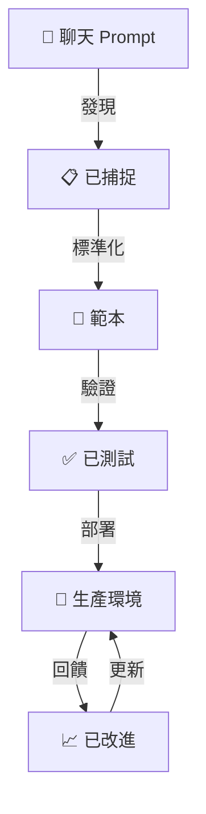

# 5 分鐘快速理解 POG

**閱讀時間：5 分鐘**

快速掌握 Prompt Orchestration Governance (POG) 的要點。本指南涵蓋理解 POG 是什麼、為何重要以及如何開始的基本內容。

---

## POG 是什麼？（30 秒）

**POG = Prompt Orchestration Governance**

可以把它想成 **Prompts 的 Git**。就像你對程式碼進行版本控制一樣，POG 幫助你：
- 📦 **儲存** prompts 作為可重複使用的資產
- 🔄 **版本化**並追蹤變更
- ✅ **驗證**使用前的品質
- 🚀 **分享**跨團隊和專案
- 📊 **改進**基於使用數據

**一句話說明**：POG 將 prompts 視為專業軟體工件，而非一次性聊天訊息。

---

## POG 解決的問題（1 分鐘）

### 沒有 POG 時：
```
開發者 A：花 30 分鐘精心製作完美的程式碼審查 prompt
           ↓
開發者 B：不知道它存在，花 30 分鐘重新創建
           ↓
開發者 C：在 Slack 找到它，無法判斷是否仍然有效
           ↓
結果：浪費時間、品質不一致、知識流失
```

### 有 POG 時：
```
開發者 A：創建 prompt → 提交到 POG repository
           ↓
系統：測試、驗證、版本化 prompt
           ↓
開發者 B、C、D：找到它、使用它、提供回饋
           ↓
結果：節省時間、品質一致、知識庫持續成長
```

**重點**：停止重複造輪子。重複使用有效的方法。

---

## POG 如何運作（2 分鐘）

### POG 生命週期



**逐步說明**：

1. **發現**：從日常工作中識別有價值的 prompts
2. **標準化**：將臨時 prompts 轉換為可重複使用的範本
3. **驗證**：針對真實場景進行測試
4. **Repository**：使用版本控制儲存
5. **使用**：團隊從中央函式庫使用
6. **改進**：收集回饋、迭代

### 兩個核心功能

#### 1️⃣ **Prompt Warehouse**
- 類似套件註冊表（npm、PyPI）但用於 prompts
- 具有搜尋和發現的中央儲存
- 版本控制和品質關卡

#### 2️⃣ **SDLC 整合**
- 按開發階段組織的 prompts
- 需求 → 設計 → 開發 → 測試 → 部署 → 維護
- 正確的 prompt、正確的時間、正確的階段

---

## 關鍵概念（1 分鐘）

### Interaction vs. Skill Prompts

| Interaction Prompt | Skill Prompt |
|-------------------|--------------|
| 💬 臨時聊天 | 📦 版本化資產 |
| 🔓 未治理 | 🔐 已治理 |
| 👤 個人 | 👥 共享 |
| ⚡ 快速簡陋 | ✨ 乾淨已測試 |

**目標**：將 interaction prompts 轉換為 skill prompts。

### POG Repository

可以把它想成：
- Prompt 檔案的 **Git repository**
- 元資料和搜尋的**資料庫**
- 驗證和部署的 **CI/CD**
- 分發的**套件管理器**

### Prompt 流程範例

```
之前（Interaction）：
"審查這段程式碼是否有錯誤"

之後（Skill Prompt）：
名稱："程式碼審查助手 v2.1"
範本："審查以下 {{LANGUAGE}} 程式碼的 {{FOCUS}}：
{{CODE}}

重點關注：
- 安全漏洞
- 效能問題  
- 最佳實踐違規"

元資料： 
- 階段：開發
- 標籤：code-review, quality
- 成功率：94%
- 使用者：47 名開發者
```

---

## 開始使用（30 秒）

### 選項 1：輕量級（1 小時設置）
```bash
# 為 prompts 創建 Git repo
mkdir prompt-library
cd prompt-library
git init

# 添加你的第一個 prompt
mkdir development
echo "# 程式碼審查 Prompt" > development/code-review.md
git add . && git commit -m "First prompt"
```

### 選項 2：先閱讀更多
- 📖 [完整文件](index.md) - 完整框架
- 📊 [查看圖表](diagrams.md) - 視覺總覽
- 🎯 [實施指南](recommendations.md) - 逐步指導

### 選項 3：從範例開始
查看[常見問題](faq.md)：
- 真實世界使用案例
- 常見問題
- 實施模式

---

## 何時使用 POG

### ✅ 使用 POG 如果：
- 您有 5 名以上開發者使用 AI 工具
- 您重複創建類似的 prompts
- 您需要跨團隊分享 prompts
- 您希望一致的品質和治理

### ⚠️ 從更小規模開始如果：
- 獨立開發者或 2-3 人團隊
- 剛開始使用 AI 工具
- 首先尋找輕量級解決方案

**建議**：從簡單的基於 Git 的方法開始，根據需要擴展。

---

## 快速成效（可以期待什麼）

### 第 1 週
- ✅ Repository 中的前 10-20 個 prompts
- ✅ 按 SDLC 階段的基本資料夾結構
- ✅ 團隊可以搜尋和發現 prompts

### 第 1 個月
- ✅ 50+ 個 prompts 涵蓋常見任務
- ✅ 開發者積極貢獻
- ✅ 可衡量的時間節省（每個開發者每月 2-4 小時）

### 第 3 個月
- ✅ 100+ 個 prompts 含使用指標
- ✅ 可見的品質改進
- ✅ 新團隊成員更快入職
- ✅ 建立強大的 ROI

---

## POG 技術堆疊（簡化版）

### 最小可行堆疊
```
Git Repository（GitHub/GitLab）
    ↓
Markdown 檔案（prompts 作為文件）
    ↓
資料夾結構（按階段組織）
    ↓
README（使用指南）
```

**成本**：免費  
**設置時間**：1-2 小時  
**維護**：最小  

### 增強堆疊（用於規模化）
```
Git Repository（版本控制）
    ↓
資料庫（元資料、搜尋）
    ↓
CI/CD 管線（驗證）
    ↓
Web UI（發現、分析）
    ↓
API（程式化存取）
```

**成本**：$100-1000/月  
**設置時間**：1-3 個月  
**維護**：1-2 人  

---

## 常見問題

### 「這不就是共享資料夾嗎？」
不是。POG 添加了：
- ✅ 版本控制和歷史記錄
- ✅ 品質驗證和測試
- ✅ 使用追蹤和改進
- ✅ 治理和存取控制
- ✅ 與開發工作流程整合

### 「我們已經在使用 ChatGPT/Claude」
POG 不是要取代它們——而是增強它們：
- 您仍然使用 ChatGPT/Claude 來**執行** prompts
- POG 幫助您**管理、分享和改進**這些 prompts
- 就像 Git 不會取代您的程式碼編輯器——它管理您的程式碼

### 「這與 prompt 函式庫有何不同？」
POG 更全面：
- ❌ Prompt 函式庫：範例 prompts 的集合
- ✅ POG：具有治理的完整生命週期管理

---

## 下一步

### 🚀 準備開始？
1. 閱讀[實施建議](recommendations.md)
2. 查看[決策框架](recommendations.md#決策框架您應該實施-pog-嗎)
3. 從試點團隊開始

### 🤔 想了解更多？
1. 查看[詳細文件](index.md)
2. 探索[架構圖表](diagrams.md)
3. 與 [PDD](comparisons/pdd.md) 和 [PDE](comparisons/pde.md) 比較

### 💬 有問題？
1. 查看[常見問題](faq.md)
2. 查看術語的[術語表](glossary.md)
3. 在 GitHub 上開啟討論

---

## 關鍵要點

🎯 **POG 將 prompts 視為一級軟體資產**

📦 **發現 → 標準化 → 驗證 → 分享 → 改進**

🚀 **從簡單開始，根據需要擴展**

⏱️ **幾週內快速成效，幾個月內重大 ROI**

🤝 **補充您現有的 AI 工具，而非取代它們**

---

**投資在本指南的時間**：~5 分鐘  
**使用 POG 您將節省的時間**：每月數小時  

**準備好開始了嗎？** 前往[實施指南](recommendations.md) →

---

*完整框架請參閱[主要 POG 文件](index.md)*
